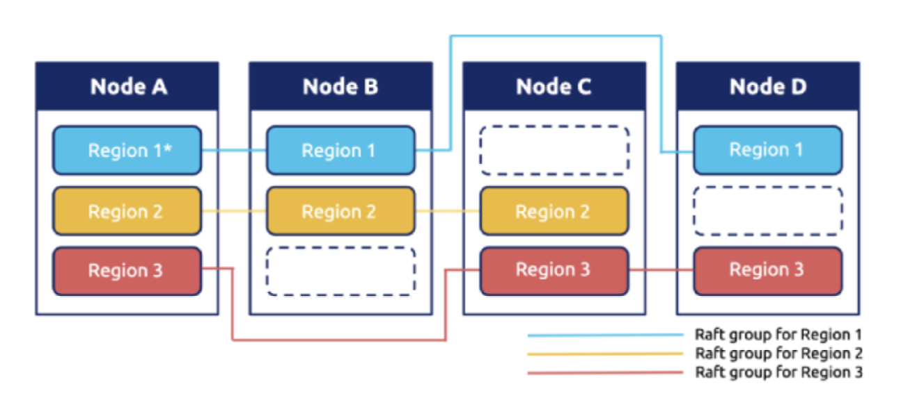

# Project1

Project1 要求构建一个支持列族（CF）的独立键值存储 gRPC 服务。

> 列族（Column Family）是将多个列作为一个整体进行管理的单位。它由一个键值对组成，其中键映射到一组列。与关系型数据库中的表类似，每个键值对相当于一行。每个列族中的列具有相同的前缀，这有助于提高数据读取和写入的效率。在多列存储（比如 MYSQL）中很显然，一列就是一个 CF。但是 KV 是单列存储的，因此为了实现 CF，必须通过单列来模拟多列，方法是在 Key 前面拼上 CF 前缀。

多列实现 CF 的结构类似下表：

| Key  | Count | Flag  | Index |
| :--: | :---: | :---: | :---: |
|  A   |   5   | True  |  12   |
|  B   |  22   | False |   8   |
|  C   |   4   | False |   6   |

单列实现 CF 的结构类似下表：

|   Key   | Value |
| :-----: | :---: |
| Count_A |   5   |
| Count_B |  22   |
| Count_C |   4   |
| Flag_A  | True  |
| Flag_B  | False |
| Flag_C  | False |
| Index_A |  12   |
| Index_B |   8   |
| Index_C |   6   |

在 Tinykv 中，涉及的 CF 有三种，分别是 Default、Lock 和 Write。它们用于支持 Project4 中的事务模型。在 Project1 中，我们暂时不需要去深入理解。在 Project1 中，和 CF 有关的方法已经在 engine_util 包下为我们提供好了， 我们直接拿来使用即可。

根据参考文档，Project1 要求我们实现的内容可以概括为以下两个部分：

1. 实现对底层 badger api 的包装，主要涉及修改的代码文件是 standalone_storage.go, 需要实现 Storage 接口的 **Write** 和 **Reader** 方法，来实现对底层 badger 数据库的读写。
2. 实现 **RawGet**，**RawScan**，**RawPut**，**RawDelete** 四个方法，主要涉及修改的代码文件是 raw_api.go

## 实现独立存储引擎 StandAloneStorage

在 `standalone_storage.go`中，查看需要我们实现的部分，如下：

```go
type StandAloneStorage struct { 
    // Your Data Here (1).
}
func NewStandAloneStorage(conf *config.Config) *StandAloneStorage {
	// Your Code Here (1).
}
func (s *StandAloneStorage) Start() error {
	// Your Code Here (1).
}
func (s *StandAloneStorage) Stop() error {
	// Your Code Here (1).
}
func (s *StandAloneStorage) Reader(ctx *kvrpcpb.Context) (storage.StorageReader, error) {
	// Your Code Here (1).
}
func (s *StandAloneStorage) Write(ctx *kvrpcpb.Context, batch []storage.Modify) error {
	// Your Code Here (1).
}
```

我们查看`storage.go`：

```go
// Storage represents the internal-facing server part of TinyKV, it handles sending and receiving from other
// TinyKV nodes. As part of that responsibility, it also reads and writes data to disk (or semi-permanent memory).
type Storage interface {
	Start() error
	Stop() error
	Write(ctx *kvrpcpb.Context, batch []Modify) error
	Reader(ctx *kvrpcpb.Context) (StorageReader, error)
}
```

显而易见，我们需要实现的独立存储引擎`StandAloneStorage`就是要实现`Storage`接口。提示中说明，我们需要实现的独立存储引擎只是 badger 键值 API 的包装器。那么，我们的`StandAloneStorage`就是对`Badger`数据库的一层包装：

```go
type StandAloneStorage struct {
    db *badger.DB
}
```

`db`字段将用于与Badger数据库进行交互，执行各种存储操作。

接下来考虑实现 `Reader` 方法。该方法要求返回一个`StorageReader`，`StorageReader`是一个在 `storage.go`中定义的接口：

```go
type StorageReader interface {
	// When the key doesn't exist, return nil for the value
	GetCF(cf string, key []byte) ([]byte, error)
	IterCF(cf string) engine_util.DBIterator
	Close()
}
```

根据参考文档提示，我们应该使用 badger.Txn 来实现 Reader 函数，所以我们需要声明一个 badgerReader 结构体来实现 StorageReader 接口，badgerReader 结构体内部包含对 badger.Txn 的引用。要实现 StorageReader 接口，就要实现其所有方法。根据提示，`engine_util` 包中已经实现了相关操作，我们直接调用就行了，比较简单，这里不再赘述。对于`Close`方法，其确保在使用完`BadgerReader`后，正确地关闭事务并释放资源。根据`Badger`的官方文档，使用其`Discard`函数丢弃事务即可。

> 在实现 GetCF 方法时，要注意 ErrKeyNotFound 不是 err，这里需要对 ErrKeyNotFound 进行特殊处理。

至此，我们已经实现了 StorageReader 接口，接下来，通过创建一个新的只读事务，并返回一个`BadgerReader`实例，我们就实现了 Reader 方法：

```go
func (s *StandAloneStorage) Reader(ctx *kvrpcpb.Context) (storage.StorageReader, error) {
	txn := s.db.NewTransaction(false)
	return &BadgerReader{txn}, nil
}
```

接下来考虑实现 `Write` 方法。该方法传入了一个包含多个`Modify`对象的切片`batch`。在`modify.go`中，可以找到对`Modify`的定义。可以发现，Modify 对象代表着 Put 和 Delete 两种操作。这两种操作在`engine_util`已经实现好了。所以，我们只需要对每一个操作，从`engine_util`中调用相应的已经实现好的函数即可。

## 实现原始键值服务处理程序

本部分要求使用实现的存储引擎构建原始键值服务处理程序，就是对存储引擎的再一次封装。具体地，我们需要在`raw_api.go`中，实现`RawGet`，`RawScan`，`RawPut`，`RawDelete`四个方法。

对于`RawGet`方法，该方法传入一个`*kvrpcpb.RawGetRequest`类型的参数，代表`RawGet`请求。函数需要返回一个`*kvrpcpb.RawGetResponse` 类型的响应。在`kvrpcpb.pb.go`中可以查看这两种类型的定义。我们需要的字段就是 `RawGetRequest`中的`Key`和`Cf`。并根据`Key`和`Cf`,使用`reader`的`GetCF`方法获取相应`value` 值，然后创建一个`RawGetResponse`响应对象，包含获取到的值`value`和一个布尔值`NotFound`，表示是否找到了该键。最后返回`RawGetResponse`响应对象即可。对于`RawPut`，`RawDelete`，`RawScan`方法也是同理，在`kvrpcpb.pb.go`中查看相应类型的定义，使用相应方法获取指定的值，根据相应的值创建相应的响应对象返回即可。

需要注意`*kvrpcpb.RawScanRequest`类型中有`Limit`字段，其限制了一次扫描操作的最大键值对数量，这对于避免一次性读取过多数据、控制内存使用和提高性能非常有用。所以在实现`RawScan`方法时要注意维护当前扫描的数量。

## Project1 总结

Project1 算是一个热身项目，比较容易，代码框架结构也比较清晰。在熟悉了 Go 语言的基本语法之后就可以跟着参考文档开始做了。

# Project2

在这个部分，我们将基于 Raft 实现一个高可用的键值服务器，这不仅需要实现 Raft 算法，还需要实际使用它，并带来更多挑战，如使用 Badger 管理 Raft 的持久化状态、为快照消息添加流量控制等。

该项目包括三个部分：

1. 实现基本的 Raft 算法（Project2A）
2. 在 Raft 上构建一个容错的键值服务器（Project2B）
3. 增加 Raft 日志 GC 和快照支持（Project2C）

Raft算法是一种用于分布式系统的一致性算法，旨在通过简化理解和实现来解决分布式一致性问题。它主要分为三个子问题：领导者选举、日志复制和安全性保证。

**领导者选举**：Raft算法将集群中的节点分为三种角色：**领导者（Leader）**、**跟随者（Follower）** 和 **候选者（Candidate）**。在正常情况下，集群中只有一个Leader，其他节点都是Follower。Leader 负责处理客户端请求并将日志条目复制到其他 Follower 节点。当集群启动时，所有节点都是Follower。如果Follower在一定时间内没有收到Leader的心跳消息，它会变成Candidate并发起选举。Candidate会向其他节点请求投票，如果获得多数节点的投票，它就成为Leader。如果Leader失效或网络分区导致无法通信，Follower会再次发起选举，选出新的Leader。

**日志复制**：Leader接收到客户端请求后，会将请求作为日志条目添加到自己的日志中，并将该日志条目复制到所有Follower节点。Follower收到日志条目后会回复Leader，Leader在收到大多数Follower的确认后提交该日志条目，并通知所有Follower提交。

**安全性保证**：Leader只能提交包含在多数节点日志中的条目，确保日志的一致性。Raft将时间分为多个任期，每个任期开始时进行一次选举。每个节点在一个任期内只能投票一次，确保一个任期内只有一个Leader。如果有任何的服务器节点已经应用了一个确定的日志条目到它的状态机中，那么其他服务器节点不能在同一个日志索引位置应用一个不同的指令。

Raft 通过基础的两个 RPC 来维持节点之间的通信，分别为日志追加 RPC（AppendEntries RPC）、请求投票 RPC（RequestVote RPC）。

>**AppendEntries RPC**：由领导人调用，发送给集群中的其他节点，用于日志条目的同步，同时也被当作心跳使用。（这里需要注意下，论文中 Heartbeat 和 AppendEntries RPC 是同一个 Msg，但在 TinyKV 中并不是，我们实现的过程中，Hearbeat 是一个独立的 Msg，和 AppendEntries RPC 不一样）
>
>**RequestVote RPC**：由候选人发送，用来征集选票。

## Project2A

Project2A 要求我们实现基本的 Raft 算法，并提供接口给上层使用。具体地，我们需要实现**领导者选举**、**日志复制**、**原始节点接口**三个部分，分别对应项目中的 **Raft**、**RaftLog**、**RawNode** 结构，分别对应项目文件 `raft.go`、`log.go`、`rawnode.go`。

**Raft**：Raft 结构是整个算法的核心，负责管理节点的状态和行为。其中，领导人选举、日志追加、角色转换等等均是在这里实现。Raft 模块会接受 RawNode 发来的信息，然后在集群中进行相关的同步操作。

**RaftLog**：RaftLog 负责管理日志条目，确保日志的一致性和持久性。

**RawNode**：RawNode 会接收从上层发来的信息，并将信息下发给 Raft，并且 Rawnode 也会收到 Raft 的同步结果然后传递给上层。可以说 RawNode 结构封装了 Raft 结构，提供了一个简化的接口供上层应用使用。

> Raft 结构包含了一个 RaftLog 实例。RaftLog 负责管理日志条目，而 Raft 结构则使用 RaftLog 来处理日志复制和一致性保证。具体来说：Raft 通过 RaftLog 来追加、提交和应用日志条目，RaftLog 提供了接口来访问和操作日志条目，确保日志的一致性和持久性。
>
> RawNode 结构封装了 Raft 结构，提供了一个简化的接口供上层应用使用。RawNode 负责初始化和管理 Raft 实例，并提供便捷的方法来与 Raft 交互。具体来说：RawNode 初始化时会创建一个 Raft 实例。上层应用通过 RawNode 来推进 Raft 状态机、处理消息和获取状态。RawNode 将上层应用的命令和消息传递给 Raft，并返回处理结果。
>
> 总结来说，RawNode 是上层应用与 Raft 交互的接口，而 Raft 则使用 RaftLog 来管理日志条目。这三个结构共同协作，实现了 Raft 算法的核心功能。

 **Raft**、**RaftLog**、**RawNode** 三个结构的关系可以用下图进行直观地表示。


在了解了三者的关系之后，我们就可以自下而上地进行编码，分别实现 **RaftLog**、**Raft** 和 **RawNode** 。

### RaftLog

先来明确 RaftLog 结构体的各个字段的含义。

|    字段名称     |                           字段含义                           |
| :-------------: | :----------------------------------------------------------: |
|     storage     |               自上次快照以来，所有的持久化条目               |
|    committed    |    已提交的最高的日志条目的索引（论文中的committedIndex）    |
|     applied     | 已经被应用到状态机的最高的日志条目的索引（论文中的lastApplied） |
|     stabled     |          已经持久化到 storage 的最后一条日志的索引           |
|     entries     |                  保存所有尚未压缩的日志条目                  |
| pendingSnapshot |               待处理的快照（Project2C中使用）                |
|   dummyIndex    | 实现时个人添加的字段，用于记录 entries 的第一条日志（entries[0]）的索引 |

> 注意，在etcd中，已持久化日志和未持久化日志是分开记录的，在tinykv中，就全部放在entries中的，那么怎么区分呢？通过`stabled`字段来区分即可，已持久化的就是`stabled`前面的日志，没持久化的就是后面的日志。

需要我们实现的第一个方法是 `newLog` 方法， newLog 方法的作用是使用给定的存储（storage）来返回一个新的 RaftLog 实例。它会将日志恢复到刚提交并应用最新快照的状态，也就是重启。我们直接通过方法参数 storage 来获取我们需要的信息即可。

```go
firstIndex, _ := storage.FirstIndex()
lastIndex, _ := storage.LastIndex()
hardState, _, _ := storage.InitialState()
entries, _ := storage.Entries(firstIndex, lastIndex + 1)
```

在获取了信息之后，我们就可以利用这些信息创建一个 RaftLog 实例，然后返回这个示例就可以了。

接着我们需要实现 `allEntries`、`nextEnts`、` unstableEntries`、`LastIndex`、`Term`方法。`allEntries`方法返回所有未压缩的条目。`nextEnts` 方法返回所有已经提交但没有应用的日志，`unstableEntries`方法返回所有未持久化到 storage 的日志，`LastIndex`方法返回日志项的最后一个索引，`Term`方法根据给定的索引，返回相应日志的任期。这些方法实现起来都比较容易，这里不再赘述，在实现过程中，注意日志索引和 entries 字段下标的对应和转换即可。

### Raft

同样地，我们先来明确 Raft 结构体各个字段的含义。

|       字段名称        |                           字段含义                           |
| :-------------------: | :----------------------------------------------------------: |
|          id           |                       节点的唯一标识符                       |
|         Term          |                          当前任期号                          |
|         Vote          |                  当前任期内投票给的候选人ID                  |
|        RaftLog        |            指向日志结构的指针，存储所有的日志条目            |
|          Prs          |       每个节点的日志复制进度，键是节点ID，值是进度信息       |
|         State         |         当前节点的角色状态（领导者、候选人、跟随者）         |
|         votes         |    记录当前任期内收到的投票情况，键是节点ID，值是是否投票    |
|         msgs          |                      需要发送的消息列表                      |
|         Lead          |                        当前领导者的ID                        |
|   heartbeatTimeout    |               心跳间隔时间，领导者定期发送心跳               |
|    electionTimeout    |                     选举超时时间的基准值                     |
|   heartbeatElapsed    |          自上次心跳超时以来经过的时间，仅领导者维护          |
|    electionElapsed    |    自上次选举超时或收到当前领导者的有效消息以来经过的时间    |
| randomElectionTimeout | 随机选举超时时间，根据论文，其范围在[electionTimeout, 2*electionTimeout]之间 |

然后，我们需要了解 Raft 的驱动规则。根据参考文档说明，Raft 使用一个逻辑时钟（命名为 tick ）来测量选举和心跳超时，而不是物理时钟。上层应用程序负责通过调用 RawNode.Tick() 来推进逻辑时钟。另外，上层接口 rawnode 通过调用 step(m pb.Message) 方法将 RPC 消息传递给 raft，raft再通过 msg 的类型和自己的类型回调不同的函数。

#### 各种 message 的含义及处理流程

接下来，我们需要了解 msg 的类型以及每种 msg 的含义和处理流程。我们查看 `proto/pkg/eraftpb.go` 中的 **MessageType**  结构体，这个结构体定义了所有类型的 msg：

```go
const (
	// 'MessageType_MsgHup' is a local message used for election. If an election timeout happened,
	// the node should pass 'MessageType_MsgHup' to its Step method and start a new election.
	MessageType_MsgHup MessageType = 0
	// 'MessageType_MsgBeat' is a local message that signals the leader to send a heartbeat
	// of the 'MessageType_MsgHeartbeat' type to its followers.
	MessageType_MsgBeat MessageType = 1
	// 'MessageType_MsgPropose' is a local message that proposes to append data to the leader's log entries.
	MessageType_MsgPropose MessageType = 2
	// 'MessageType_MsgAppend' contains log entries to replicate.
	MessageType_MsgAppend MessageType = 3
	// 'MessageType_MsgAppendResponse' is response to log replication request('MessageType_MsgAppend').
	MessageType_MsgAppendResponse MessageType = 4
	// 'MessageType_MsgRequestVote' requests votes for election.
	MessageType_MsgRequestVote MessageType = 5
	// 'MessageType_MsgRequestVoteResponse' contains responses from voting request.
	MessageType_MsgRequestVoteResponse MessageType = 6
	// 'MessageType_MsgSnapshot' requests to install a snapshot message.
	MessageType_MsgSnapshot MessageType = 7
	// 'MessageType_MsgHeartbeat' sends heartbeat from leader to its followers.
	MessageType_MsgHeartbeat MessageType = 8
	// 'MessageType_MsgHeartbeatResponse' is a response to 'MessageType_MsgHeartbeat'.
	MessageType_MsgHeartbeatResponse MessageType = 9
	// 'MessageType_MsgTransferLeader' requests the leader to transfer its leadership.
	MessageType_MsgTransferLeader MessageType = 11
	// 'MessageType_MsgTimeoutNow' send from the leader to the leadership transfer target, to let
	// the transfer target timeout immediately and start a new election.
	MessageType_MsgTimeoutNow MessageType = 12
)
```

msg 分为两种，分别为 Local message 和 Common message。Local message 是本地发起的 message， Common message是其他节点通过网络发来的 msg。下面我们分别介绍这 13 种 msg。

##### MessageType_MsgHup

这是一个 Local message，用于请求节点开始进行选举。

当节点收到该 message 时，会执行以下流程：

1. 将自己变更为候选者（Candidate）
2. 如果集群中只有自身这一个节点，那么自己直接成为领导者（Leader），结束。否则，继续执行3
3. 遍历集群中除自身外的所有其它节点，向其发送 MessageType_RequestVote 请求，目的是让其它节点给自己投票
4. 重置自身的投票信息，并投票给自己

##### MessageType_MsgBeat

这是一个 Local message，用于告知领导者该发送心跳（MessageType_MsgHeartbeat）给其它节点了。

只有领导者才会响应此 message，当领导者节点收到该 message 时，会执行以下流程：

1. 遍历集群中除自身外的所有其它节点，向其发送 MessageType_MsgHeartbeat 心跳请求
2. 重置自身的 heartbeatElapsed 字段

##### MessageType_MsgPropose

这是一个 Local message，用于追加从上层应用接收到的新日志，并广播给 Follower。

只有领导者才会响应此 message，当领导者节点收到该 message 时，会执行以下流程：

1. 判断 leader 此时是否处于领导权变更阶段（节点的 leadTransferee 字段是否不为空），如果是，直接返回。（领导者变更在 Project3 再讲述）
2. 把 m.Entries 追加到自己的 Entries 中，并设置新日志的索引和任期。
3. 更新自身的日志复制进度（Prs 字段）
4. 遍历集群中除自身外的所有其它节点，向其发送 MessageType_MsgAppend 同步日志请求

> 注意，对于第 4 条的处理，如果集群中只有自己一个节点，则直接更新自己的 committed 字段即可。

##### MessageType_MsgAppend

这是一个 Common message，用于领导者给其它节点进行日志同步。

在前面说过，当领导者节点收到 MessageType_MsgPropose 消息时，会遍历集群中除自身外的所有其它节点，向其发送 MessageType_MsgAppend 同步日志请求。如果领导者发送的 MessageType_MsgAppend 同步日志请求被拒绝时，领导者会根据返回的 Index  字段信息调整其 next 重新尝试同步。另外，当 Leader append 日志时，如果发现对方所需要的 entry 已经被 compact。此时 Leader 会发送 Snapshot 过去，具体细节在 Project2C 再讲述。

当节点收到 MessageType_MsgAppend 同步日志请求时，会执行以下流程：

1. 判断对方的任期是否更小，如果对方的任期更小，直接拒绝其同步请求（将 Reject 字段置为 true）
2. 判断 prevLogIndex 是否大于自己的最后一个日志条目的索引（使用已经实现的 LastIndex 方法获取），如果大于，说明这个节点漏掉了这个日志条目，需要重新获取这个日志条目，也应该直接拒绝其同步请求
3. 判断 prevLogTerm 是否和自己最后一个日志条目的任期是否一致，如果不一致，说明出现了日志冲突。
4. 如果出现日志冲突了，需要将 prevLogIndex 缩小，再次去匹配前一个log，直到匹配成功后，将entry追加或者覆盖到本节点上

5. 接受日志同步请求，同步自身 RaftLog 的 entries、commited、stabled 等字段，并给对方回复 MessageType_MsgAppendResponse 的回复 message。

> 在 Raft 论文中有提到，如果出现日志冲突了，需要将 prevLogIndex 缩小，再次去匹配前一个log，直到匹配成功后，将entry追加或者覆盖到本节点上，这个过程是可以优化的。具体来说，我们可以直接定位到冲突任期的上一个任期的最后一个日志，显然不冲突的日志只可能在这之前，相比每次 index 减 1 来说，这种方式会提高不少的效率。另外实际测试不要求此优化，即使不这样做也是可以通过测试的。
>
> 另外注意，节点同步日志条目时，会发生舍弃自身冲突的日志强行与Leader日志同步的情况，这时候要更新一下 RaftLog 的 stabled 字段的值，因为可能有些日志已经被持久化到 storage 中，但是因为冲突被舍弃掉了，如果不这样做可能会发生 runtime error：slice bounds out of range。具体地，我们在日志同步时，将 stabled 字段的值更新为min(历史stabled值,发生冲突的 index 值 - 1)即可。

##### MessageType_MsgAppendResponse 

这是一个 Common message，用于节点回复领导者的日志同步请求（MessageType_MsgAppend），即告诉领导者日志同步的结果。

只有领导者才会响应此 message， 当领导者节点收到该 message 时，会执行以下流程：

1. 如果是被拒绝了，判断对方的任期是否大于自己，如果大于自己，显然自己就无法成为 Leader 了，直接变为 Follower；否则，说明发生了日志冲突，那么就根据返回的 Index 调整其 Prs 的 Next 字段重新尝试同步。
2. 如果被接受了，表明日志被对方成功同步，那么就处理可能发生的日志提交，如果发生日志提交，则要广播给所有的 Follower 也提交该日志。

> 可以按照 Raft论文的思路高效率得更新 commit。假设存在 N 满足 N > commitIndex，使得大多数的 matchIndex[i] ≥ N 且 log[N].term == currentTerm ，则令 commitIndex = N。为了快速更新可先将节点按照 match 排序。

##### MessageType_MsgRequestVote

这是一个 Common message，用于候选者（Candidate）请求节点给自己投票。

当节点成为 Candidate 并发起选举时，会遍历集群中除自身外的所有其它节点，向其发送 MessageType_RequestVote 请求。

当节点接收到此 message 时，会判断以下条件：

1. Candidate 任期大于自己并且日志足够新
2. Candidate 任期和自己相等并且自己在当前任期内没有投过票或者已经投给了 Candidate，并且 Candidate 的日志足够新

如果满足上述条件，就投票给 Candidate，即将其 Vote 字段更新为 Candidate 的 id，若不满足就拒绝投票给 Candidate。

节点会返回一个 MessageType_MsgRequestVoteResponse ，用于回复 Candidate 投票结果。

##### MessageType_MsgRequestVoteResponse 

这是一个 Common message，用于节点告诉 Candidate 投票结果。

前文提到，当节点接收到 MessageType_MsgRequestVote 投票请求时，会返回一个 MessageType_MsgRequestVoteResponse ，用于回复 Candidate 投票结果。

当 Candidate 接收到此 message 时，会执行以下流程：

1. 根据 Reject 字段判断对方是否给自己投票，维护自身的 votes 字段。
2. 计算自己获得的票数，如果集群中半数以上节点投票给自己，那么自己就成为领导者。
3. 如果票数不足，则判断对方是否任期更大，如果对方任期更大，自己直接成为跟随者（Follower）。
4. 如果半数以上节点拒绝给自己投票，那么自己也直接成为跟随者（Follower）。

> 对于第 4 条，测试要求的逻辑是这样，可能测试是为了防止这个耗费资源，这个节点已经不可能成为leader了，就别想再尝试当选了。

##### MessageType_MsgSnapshot

这是一个 Common message，用于领导者将快照发送给其它节点。

快照部分在 Project2C 再进行阐述，这里暂且跳过。

##### MessageType_MsgHeartbeat

这是一个 Common message，用于领导者给集群中其它节点发送心跳。不同于论文中使用空的追加日志 RPC 代表心跳，TinyKV 给心跳一个单独的 MsgType。

当领导者的 heartbeatElapsed 字段达到 heartbeatTimeout 时，就会遍历集群中除自身外的所有其它节点，向其发送 MessageType_MsgHeartbeat 心跳。

当节点接收到此 message 时，会执行以下流程：

1. 判断是否是一个任期比自己小的心跳请求，如果是，直接拒绝此心跳
2. 信任对方是 Leader，自己变为其跟随者（Follower）
3. 重置自身的 electionElapsed 字段，给对方回应 MessageType_MsgHeartbeatResponse 的 message。

##### MessageType_MsgHeartbeatResponse

这是一个 Common message，用于节点给领导者回复 MessageType_MsgHeartbeat 心跳。

前文提到，当节点接收到领导者发送的 MessageType_MsgHeartbeat 心跳时，会

对方回应 MessageType_MsgHeartbeatResponse 的 message。

只有领导者才会响应此 message， 当领导者节点收到该 message 时，会执行以下流程：

1. 判断是否对方拒绝了自己的心跳，如果对方拒绝了自己的心跳，说明对方的任期更高，自己直接变成跟随者（Follower）
2. 如果心跳被接受，判断对方是否日志已同步，如果不同步，则向其发送 MessageType_MsgAppend 日志同步请求。

##### MessageType_MsgTransferLeader

这是一个 Local message，用于上层请求领导者变更。

领导者变更是 Project3 的内容，这里暂且跳过。

##### MessageType_MsgTimeoutNow

这是一个 Local message，用于节点作为领导者变更目标收到 MsgTimeoutNow，并发起选举。

领导者变更是 Project3 的内容，这里暂且跳过。

#### Raft 驱动

在了解了每个 message 的含义及大致处理流程后，我们考虑实现 Raft 驱动。

前文说过，上层应用程序负责通过调用 RawNode.Tick() 来推进逻辑时钟，上层接口 rawnode 通过调用 step(m pb.Message) 方法将 RPC 消息传递给 raft。我们需要实现 `raft/raft.go`中的 `tick`方法和 `Step`方法。

##### tick

tick 方法用于推进逻辑时钟。具体地，对于非领导者节点，就是自增自己的 electionElapsed 字段；对于领导者节点，就是自增自己的 heartbeatElapsed 字段。对于非领导者，如果 electionElapsed 达到了 randomElectionTimeout，表明心跳超时，此时要通过 Step 方法发起选举，尝试成为领导者；对于领导者，如果 heartbeatElapsed 达到了 heartbeatTimeout，就会通过 Step 方法告知领导者该发送心跳给集群中的其它节点了。

> 注意，当 electionElapsed 达到 randomElectionTimeout 或是 heartbeatElapsed 达到 heartbeatTimeout 时，要注意重置 electionElapsed 或是 heartbeatElapsed 字段。

##### Step

step 方法用来接收上层发来的 message，然后根据不同的角色和不同的 MsgType 进行不同的处理。根据节点的角色（Leader、Follower、Candidate），需要响应不同的 message，如下：

```go
func (r *Raft) Step(m pb.Message) error {
	switch r.State {
	case StateFollower:
		switch m.MsgType {
		case pb.MessageType_MsgHup:
			// 请求节点开始选举(发起投票)
		case pb.MessageType_MsgAppend:
			// Leader 给其他节点同步日志条目
		case pb.MessageType_MsgRequestVote:
			// Candidate 请求投票
		case pb.MessageType_MsgHeartbeat:
			// Leader 发送的心跳
		case pb.MessageType_MsgSnapshot:
			// Leader 将快照发送给其他节点
		}
	case StateCandidate:
		switch m.MsgType {
		case pb.MessageType_MsgHup:
			// 请求节点开始选举(发起投票)
		case pb.MessageType_MsgAppend:
			// Leader 给其他节点同步日志条目
		case pb.MessageType_MsgRequestVote:
			// Candidate 请求投票
		case pb.MessageType_MsgRequestVoteResponse:
			// 节点告诉 Candidate 投票结果
		case pb.MessageType_MsgHeartbeat:
			// Leader 发送的心跳
		case pb.MessageType_MsgSnapshot:
			// Leader 将快照发送给其他节点
		}
	case StateLeader:
		switch m.MsgType {
		case pb.MessageType_MsgBeat:
			// Leader 发送心跳
		case pb.MessageType_MsgPropose:
			// 上层请求 propose 条目。
		case pb.MessageType_MsgAppend:
			// Leader 给其他节点同步日志条目
		case pb.MessageType_MsgAppendResponse:
			// 节点告诉 Leader 日志同步是否成功，和 MsgAppend 对应
		case pb.MessageType_MsgRequestVote:
			// Candidate 请求投票
		case pb.MessageType_MsgHeartbeatResponse:
			// 节点对心跳的回应
		}
	}
	...
}
```

具体每个角色对每个 message 的处理，我们依照前文的流程即可。这里编码过程比较繁琐，考虑的细节比较多，建议理清整体思路再下手编码，尽量不要边写边想，并且尽量要有模块化的思维，某些通用的过程能抽取成函数方法就抽取成函数方法，减少代码的冗余的同时，也能让自己的思路更加清晰。

### RawNode

RawNode 会接收从上层发来的信息，并将信息下发给 Raft，并且 Rawnode 也会收到 Raft 的同步结果然后传递给上层。可以说 RawNode 结构封装了 Raft 结构，提供了一个简化的接口供上层应用使用。

在`raft/rawnode.go`中定义了 **Ready** 结构体，Ready 结构体用于保存已经处于 ready 状态的日志和消息， 这些都是准备保存到持久化存储、提交或者发送给其他节点的。

先来明确 Rawnode 中的 **Ready** 结构体各个字段的含义：

|     字段名称     |                           字段含义                           |
| :--------------: | :----------------------------------------------------------: |
|    *SoftState    |          表示节点的易失性状态，如果没有更新则为nil           |
|   pb.HardState   | 表示节点的持久状态，必须在发送任何消息之前保存到稳定存储中，如果没有更新则为nil |
|     Entries      |     需要在发送任何消息之前保存到稳定存储中的日志条目列表     |
|     Snapshot     |                  指定要保存到稳定存储的快照                  |
|     entries      |                  保存所有尚未压缩的日志条目                  |
| CommittedEntries | 需要被输入到状态机中进行 apply 的日志，这些日志之前已经被保存到 Storage 中了 |
|     Messages     |          在日志被写入到 Storage 之后需要发送的消息           |

简言之，SoftState 不需要被持久化，用于在 HasReady() 方法中判断是否有产生新的 Ready，而 HardState 需要上层进行持久化存储。

#### RawNode 执行流程

接下来我们理清 RawNode 的整个执行流程。

首先，上层会不停的调用 RawNode 的 tick() 函数，如下：

```go
 // Tick advances the internal logical clock by a single tick.
func (rn *RawNode) Tick() {
	rn.Raft.tick()
}
```

可以看到， RawNode 的 tick() 函数实际上就是调用其封装的 Raft 的 tick() 函数。

接着，上层会定时地从 RawNode 中获取 Ready。具体地，上层会通过`HasReady()`方法判断是否已经有同步完成并且需要上层处理的信息，如果此方法返回 True，上层则会调用 `Ready()` 方法获取 Ready。上层应用处理完 Ready 后，会调用 `Advance()`方法推进整个状态机。

我们需要实现的是`HasReady()`、 `Ready()` 、 `Advance()` 三个方法，在理清了 RawNode 的执行流程之后，我们的思路就比较清晰了。

##### HasReady

HasReady 方法判断是否已经有同步完成并且需要上层处理的信息。具体地，如果满足以下任意条件，就代表有需要上层处理的信息，直接返回 True即可：

1.  HardState发生更新，表明有需要持久化的状态
2.  有需要持久化的条目
3.  有需要应用的条目
4.  有需要发送的 Message
5.  有需要应用的快照

##### Ready

Ready 方法返回 RawNode 的当前时间点状态，上层通过此方法获取 Ready。具体地，我们需要通过 RawNode 封装的 Raft 来获取相应的状态信息，比如 `Messages`、`Entries`、`CommittedEntries` 字段。并且，我们需要判断 HardState 或者 SoftState 是否发生了更新，以及判断是否有等待应用的快照。

> 注意，虽然 SoftState 不需要上层来进行持久化，但是测试需要维护该字段。

##### Advance

Advance 方法会告知 RawNode，应用程序已经应用并保存了最后一个 Ready 结果中的进度。上层会调用该方法来推进整个状态机。具体地，我们需要更新 RawNode 的状态。比如记录 SoftState 和 HardState 的更新情况、更新 RaftLog 状态、清空 pendingSnapshot 和 msg 字段等等。

### Project2A 总结

Project2A 相比 Project1 来说，难度大大提升，下面我总结了我认为的三大难点，并给出了我的应对方案，可供大家参考。

1. 理解 Raft 算法。虽然论文中对 Raft 算法的讲述比较详尽，但是涵盖的内容很多，并且中文版本的论文涉及翻译问题，很难一次就理解个大概。

   > 动画演示很有用，结合动画演示可以很好地帮助理解 Raft 算法。

2. 项目代码框架的理解。涉及的结构体很多，结构体中字段很多，方法很多，初次看到代码非常头疼，几乎不知从何做起。

   > 把握三个子任务：领导者选举（Project 2aa）、实现日志复制（Project 2ab）、实现原始节点接口（Project 2ac），先实现 Project 2aa 和 2ab，最后实现 2ac。
   >
   > ---
   >
   > 很大的工作量在 Project 2aa 和 2ab。开始实现前，结合论文，搞懂 `RaftLog` 、`Raft`、 `Message`、`Entry`、`Progress`、`Storage`分别是做什么的，里面的字段分别有什么含义，哪些字段是我们需要用到的。
   >
   > ---
   >
   > `MessageType` 将消息划分成了若干类型，理清 `Leader`、`Candidate`、`Follower`分别需要处理哪些类型的消息。这又会将任务划分成了若干个子任务，我们可以各个击破，这样实现起来思路就比较清晰了。

3. 代码实现的细节。需要考虑的情况很多，比如 节点投票的条件，节点状态转换的时机，发送Message需要维护的字段，日志条目索引和切片下标的对应，极端情况的处理（比如网络中只有唯一一个节点）等等。

   > 结合论文，结合报错信息和测试信息，多调试。

## Project2B

Project2B 将使用 Project2A 中实现的 Raft 模块建立一个容错的 KV 存储服务。下图是一个 KV 系统的逻辑结构（来自 TiKV）。


根据上图，我们需要明确 **Store**、**Region**、**Peer** 的概念。

**Store**：每一个节点称为一个 Store，代表 tinykv-server 的一个实例，也就是项目代码里的 RaftStore。

**Peer**：运行在 Store 上的一个 Raft 节点称为 Peer。根据图中可以得知，每个 RaftStore 里面会包含多个 Peer，一个 RaftStore 里面的所有 Peer 公用同一个 badger 实例。

**Region**：Region 是 Peer 的集合，也叫 RaftGroup。根据图中可以得知，一个 Region 会包含多个 Peer，这些 Peer 分布在不同的 RaftStore 上。

当然，在 Project2 部分，cluster 结构得到了简化，如下图。完整的结构会在 Project3 部分引入。


可以看到，每个 RaftStore 上只有一个 Peer，整个 cluster 也只有一个 Region。

到这里，可能还无法直观地得知 Project2B 要干什么。我们通过下图来进一步说明。


我们在 Project2A 实现了 **Raft**、**RaftLog**、**RawNode** 三个模块，它们构成了 **raft** 层。在 Project2B，我们需要实现的是中间的 **peer** 层。peer 层的任务是：接收客户端（client）传来的命令请求 RaftCmdRequest，将其处理成日志条目的形式传递给下层的 raft ，在 raft 层中进行同步。然后不断调用2A中实现的  HasReady 方法获取下层的 Ready，获取 Ready 后对其进行处理，包括发送raft消息、持久化状态、将提交的日志项应用到状态机等等。

具体需要我们实现的内容在 `peer_msg_handler.go` 和 `peer_storage.go`文件中。

### peer_msg_handler

在 `peer_msg_handler.go` 文件中，需要我们实现`HandleRaftReady()`方法和  `proposeRaftCommand()` 方法。

#### proposeRaftCommand

proposeRaftCommand 方法用于将 client 的请求包装成 entry 传递给 raft 层。

```go
func (d *peerMsgHandler) proposeRaftCommand(msg *raft_cmdpb.RaftCmdRequest, cb *message.Callback) {}
```

该方法有两个参数，第一个是 msg，也就是客户端（client）传来的命令请求 RaftCmdRequest；第二个是一个回调函数 cb，我们需要记录这个回调函数与本条日志的索引，等待 apply 这条记录到状态机执行完后，就回调它，并将返回值返回，这样，上层才能得知传递到下层的命令请求 RaftCmdRequest 是否真正被合法执行，具体流程后文会阐述。

查看 RaftCmdRequest 的定义，如下：

```go
type RaftCmdRequest struct {
	Header *RaftRequestHeader
	// We can't enclose normal requests and administrator request
	// at same time.
	Requests             []*Request    
	AdminRequest         *AdminRequest 
	XXX_NoUnkeyedLiteral struct{}      
	XXX_unrecognized     []byte        
	XXX_sizecache        int32        
}
```

可以发现，客户端的命令请求包含两种类型，一种是 **Request**，另一种是 **AdminRequest**。在 Project2B 中，我们只需要考虑 Request 请求，AdminRequest 请求将在后续中引入。

继续查看 **Request** 的定义，可以发现 Request 有以下五种类型。

```go
type CmdType int32
const (
	CmdType_Invalid CmdType = 0
	CmdType_Get     CmdType = 1
	CmdType_Put     CmdType = 3
	CmdType_Delete  CmdType = 4
	CmdType_Snap    CmdType = 5
)
```

注意，在 Project2B 中，处理 RaftCmdRequest 时，也要处理 CmdType_Snap 类型的命令请求。尽管它的名称为 Snap，其实和 Project 2C 中的快照不是一个含义，它对应的其实是客户端的 RawScan 操作。

我们如何将 RaftCmdRequest 类型的命令请求转换成相应的日志条目 entry 呢？通过**序列化**。具体地，我们通过 `msg.Marshal()`方法将 msg 转化为字节流，然后调用 `d.RaftGroup.Propose()` 方法就可以将序列化的字节流包装成 entry 传递给 raft 层，raft 层会接收到MessageType_MsgPropose 类型消息来响应这些新增的 entry。

> 项目代码提供了 Marshal 和 Unmarshal 方法逻辑。若是对序列化操作不熟悉的话，一开始可能会卡一下不知道怎么向 raft 层传递。

紧接着，我们需要为该 msg 创建一个 proposal，该 proposal 会维护当前请求转换成的 entry 的 Term 和 Index，以及指向 message.Callback 结构体的指针，Index 和 Term 共同用于唯一标识一个请求。该 proposal 会添加到 **proposals** 切片字段中。当这个请求对应的 entry 被提交并应用之后，则会在 proposals 切片中定位到此 proposal 进行 callback 回应，代表这条命令请求已经处理完毕了。此外，回调过程也会传递信息，比如 Get 命令获取到的 value 就通过回调过程传递给客户端。

#### HandleRaftReady

HandleRaftReady 方法用于处理 raft 层的 rawNode 传递来的 Ready。

首先，调用在 Project2A 中实现的 HasReady 方法判断 raft 层是否有新的 Ready，如果没有，就什么都不需要处理，直接退出即可。如果有，则调用 Project2A 中实现的 Ready 方法获取最新的 ready。处理 raft 层的 rawNode 传递来的 Ready，具体就是要做以下事情：

1. 调用 SaveReadyState 方法将 Ready 中需要持久化的内容保存到 badger
2. 调用 d.Send() 方法将 Ready 中的 Msg 发送出去。具体来说，这个方法会将 Ready 结构体中的 Messages 字段中的消息通过 d.ctx.trans 传输出去。raft 节点之间心跳、投票请求、日志复制等消息的收发传递就是在这里实现的
3. 应用 Ready 里待 apply 的日志，也就是 CommittedEntries 字段里的日志，另外需要在 proposals 切片中定位到此 proposal 进行 callback 回应，代表这条命令请求已经处理完毕。
4. 调用 Project2A 中实现的 d.RaftGroup.Advance 方法推进 raft 层 RawNode 的状态

需要格外注意的是，在回复 proposal 时，对于过期的 proposal，要及时地将其从 proposals 列表中删除，防止这些过期的 proposal 在列表中堆积。

>即使不这么做，也可以通过测试。但让过期的 proposal 一直在列表里堆积，会很影响后续遍历 proposals 列表的效率。
>
>对将要处理的 entry 而言，Term 或是 Index 较小的 proposal 都属于过期的 proposal。所以在遍历 proposals 列表时，如果发现了 Term 和 Index 较小的 proposal，直接从列表中删除。

### peer_storage

在`peer_storage.go`文件中，需要我们实现`Append()`方法和`SaveReadyState()`方法。

根据参考文档内容，peer storage 是通过 Project2A 中的存储接口进行交互，但是除了 raft 日志之外，peer storage 还管理着其他持久化的元数据，这对于重启后恢复到一致的状态机非常重要。此外，在 `proto/proto/raft_serverpb.proto` 中定义了三个重要状态。

**RaftLocalState**：用于存储当前 Raft hard state 和 Last Log Index。

**RaftApplyState**：用于存储 Raft applied 的 Last Log Index 和一些 truncated Log 信息。

**RegionLocalState**：用于存储 Region 信息和该 Store 上的 Peer 状态。Normal 表示该 peer 是正常的，Tombstone 表示该 peer 已从 Region 中移除，不能加入 RaftGroup 中。

此外，我们还需要明确 **raftDB** 和 **kvDB**。这是两个 Badger 实例，分别存储不同的内容。

**raftDB** 用于存储 Ready 中需要 stable 的 entries 以及 RaftLocalState。

**kvDB** 用于存储 RaftApplyState 以及 RegionLocalState。

#### SaveReadyState

SaveReadyState 方法将内存状态保存到磁盘（持久化）。将 raft.Ready 中的数据保存到 badger 中，包括追加日志和保存 Raft hard state。

具体地，我们就是要做以下事情：

1. 判断 ready 中是否存在 HardState，如果有，则要将 HardState 保存到 ps.raftState.HardState 中
2. 调用 raftDB.SetMeta 方法持久化 RaftLocalState 到 raftDB 中
3. 调用 Append 方法将需要持久化的 entries 保存到 raftDB 中，Append 方法的实现逻辑下文阐述
4. 调用 raftWB.WriteToDB 方法进行原子地写入到存储引擎

#### Append

Append 方法用于将 Ready 中的 entries 持久化到 raftDB 中去，然后更新 RaftLocalState 的状态。同时，如果底层存储有冲突条目，也要将其删除。流程如下：

1. 调用 raftWB.WriteToDB 方法将 Ready 中的 entries 持久化到 raftDB
2. 调用 raftDB.DeleteMeta 方法删除冲突条目。在 Raft 协议中，当领导者（Leader）发送新的日志条目时，可能会覆盖之前已经存在但未提交的条目。这些未提交的条目被认为是冲突条目，需要删除以确保日志的一致性
3. 利用 entries 最后的日志条目信息更新 RaftLocalState 的状态

> 导致底层存储有冲突条目的原因是  Leader 发送新的日志条目时，可能会覆盖之前已经存在但未提交的条目。这些未提交的条目被认为是冲突条目，需要删除以确保日志的一致性。
>
> 我们在将 entries 持久化到 raftDB 中时，可以获取当前 entries 的最新索引，那么凡是底层存储中拥有比这个最新索引更大的日志条目都是冲突的条目，使用 raftWB.DeleteMeta 方法将这些冲突的日志条目删除。
>
> 即使不这么做，也可以通过测试。但是为了防止这些冲突条目占用存储资源，删除掉是必要的。

### Project2B 总结

Project2B 相比于 Project2A 难度更上一层楼，主要体现在以下方面：

1. 理清 Project2B 中需要实现的部分和 Project2A 的关系。

> Project2A 实现了 Raft 协议，Project2B 要求在此基础上实现 KV 服务。我们需要根据客户端传来的命令请求 RaftCmdRequest，在proposeRaftCommand 方法中将其变成 entry 的 MessageType_MsgPropose 类型的消息传递给下层的 raft ，在project2A中进行同步。然后不断调用2A中实现的  HasReady 方法获取下层的 Ready，获取 Ready 后对其进行处理，包括发送raft消息、持久化状态、将提交的日志项应用到状态机。

2. Project2B 并非静态测试而是随机测试。由于随机测试，很多错误可能需要测试很多遍才能够发现；并且对于 2B 的测试不像之前的测试瞬间就能跑完，需要花费一定的时间；再加上涉及到历史代码的修改和重构。整个调试过程比较痛苦。

> 要维持住心态，特别是当改着改着发现连 project2A 反而都出问题的时候。

3. 一些要处理的情形在参考文档中明确给出，但是测试却覆盖不到（下面会提到）。尽管这些情形不会影响实现 KV 的服务的正确性，但是会影响运行效率和资源浪费，所以有处理的必要。

> 多看参考文档的提示和要求，有些情形也会在代码的注释说明里提到。

## Project2C

Project2C 要求实现**快照**功能。为什么需要快照？考虑一个长期运行的服务器，Raft 日志会随着时间推移不断增多，显然储存所有的 Raft 日志是不现实的。相反，服务器会检查Raft日志的数量，并不时地丢弃超过阈值的日志。

快照的实现可以分为五个部分：快照生成与分发，快照接收，快照应用，日志压缩。我们逐个进行梳理。

### 快照流程

#### 快照生成与分发

当 Leader 发现要发给 Follower 的 entry 已经被压缩时，就会通过 r.RaftLog.storage.Snapshot() 方法生成一份快照 Snapshot，并将生成的 Snapshot 发送给对应节点。

我们可以查看 `storage.go` 中的 **CreateSnapshot** 方法了解 Snapshot 是如何生成的：

```go
// CreateSnapshot makes a snapshot which can be retrieved with Snapshot() and
// can be used to reconstruct the state at that point.
// If any configuration changes have been made since the last compaction,
// the result of the last ApplyConfChange must be passed in.
func (ms *MemoryStorage) CreateSnapshot(i uint64, cs *pb.ConfState, data []byte) (pb.Snapshot, error) {
	ms.Lock()
	defer ms.Unlock()
	if i <= ms.snapshot.Metadata.Index {
		return pb.Snapshot{}, ErrSnapOutOfDate
	}

	offset := ms.ents[0].Index
	if i > ms.lastIndex() {
		log.Panicf("snapshot %d is out of bound lastindex(%d)", i, ms.lastIndex())
	}

	ms.snapshot.Metadata.Index = i
	ms.snapshot.Metadata.Term = ms.ents[i-offset].Term
	if cs != nil {
		ms.snapshot.Metadata.ConfState = cs
	}
	ms.snapshot.Data = data
	return ms.snapshot, nil
}
```

分析这个方法可知，Snapshot 的作用就是记录当前存储的索引、任期、配置状态和数据，以便在系统崩溃或重启时，可以通过 Snapshot 快速恢复到之前的状态，减少数据恢复时间。生成的 Snapshot 会保存到 MemoryStorage 结构体的 snapshot 字段中去，当调用 r.RaftLog.storage.Snapshot() 方法时，这个方法就会直接返回其 snapshot 字段，这就是 snapshot 的获取逻辑。

```go
// Snapshot implements the Storage interface.
func (ms *MemoryStorage) Snapshot() (pb.Snapshot, error) {
	ms.Lock()
	defer ms.Unlock()
	return ms.snapshot, nil
}
```

需要注意的是，snapshot 的生成不是瞬时完成的，而是异步的，通过发送 RegionTaskGen 到 region_task.go 中处理，会异步地生成 snapshot。这就意味着，我们调用 r.RaftLog.storage.Snapshot( ) 方法想要获取 snapshot 时，有可能 snapshot 还在生成，这时候方法会返回一个 raft.ErrSnapshotTemporarilyUnavailable 错误。为了避免阻塞，Leader 就应该放弃本次 Snapshot，等待下一次再次请求 Snapshot。Raft 状态机也就能知道存储需要一些时间来准备快照，并稍后调用 Snapshot。

```go
// sendSnapshot 发送快照给其它节点(to)
func (r *Raft) sendSnapshot(to uint64) {
    ...
	snapshot, err := r.RaftLog.storage.Snapshot()
	if err != nil {
		// raft.ErrSnapshotTemporarilyUnavailable
		// Leader 就应该放弃本次 Snapshot，等待下一次再次请求 Snapshot。
		return
	}
	...
}
```

快照消息的发送可以理解为像普通的 message 一样，经由`pb.MessageType_MsgSnapshot` 通过 `Step()` 输入 RawNode。然而 snapshot 发送的底层逻辑却和普通 message 有区别，因为 snapshot 有可能很大，底层实际上会将其分块发送。

#### 快照接收

在 RaftLog 中，有一个 **PendingSnapshot** 字段，收到 leader 的快照的时候，会将快照保存在此处，后续会把快照保存到 Ready 中去，上层应用会应用 Ready 里面的快照。具体地，节点成为其跟随者，并会根据其中的 Metadata 来更新自己的 committed、applied、stabled 等字段，并根据 m.Snapshot.Metadata.ConfState.Nodes 来更新自身的集群配置。

> 注意，如果对方 term 小于自身的 term ，代表这是一个过期的快照，需要直接拒绝这次快照的数据；另外，如果已经提交的日志大于等于快照中的日志，也需要拒绝这次快照，因为已经 Commit 的日志最终会被 apply，如果强行更新为快照的状态，就会丢失已经提交的日志条目。具体地，我们可以判断当前节点的 RaftLog 的 committed 字段和 message 的 Snapshot.Metadata.Index 的大小，如果前者更大，说明当前节点已经提交的日志大于等于快照中的日志，此时应该拒绝这个快照。
>
> 另外，在推进节点状态机（Advance方法）时，要及时清空 pendingSnapshot 字段，如果不及时清空，HasReady 方法会一直返回 true，那么上层会一直认为有快照需要应用，造成不必要的处理。若忽略这点，TestSnapshotUnreliable2C 可能会检测到。

#### 快照应用

在快照接收中提到，节点接收到的 snapshot 最终会保存到 Ready 的 Snapshot 字段里。因此，在 `HandleRaftReady `方法中，发现 Ready 中有 snapshot，就会在 `SaveReadyState` 方法里应用这个 snapshot，具体地，就是在 `SaveReadyState `方法里调用 `ps.ApplySnapshot` 方法应用。`ApplySnapshot`方法需要我们来实现，具体就是要我们删除过时数据、更新 peer_storage 的内存状态、发送 runner.RegionTaskApply 任务给 region worker，并等待处理完毕（将 Snapshot 应用到 kvDB 中）。

#### 日志压缩

在 HandleMsg( ) 会中收到 message.MsgTypeTick，然后进入 onTick( ) 方法，在 onTick() 方法中会调用 d.onRaftGCLogTick( ) 方法。这个方法会检查 appliedIdx - firstIdx >= d.ctx.cfg.RaftLogGcCountLimit，即未应用的 entry 数目是否大于等于你的配置。如果是，就开始进行压缩。

```go
func (d *peerMsgHandler) onRaftGCLogTick() {
	if appliedIdx > firstIdx && appliedIdx-firstIdx >= d.ctx.cfg.RaftLogGcCountLimit {
		compactIdx = appliedIdx
	}
	request := newCompactLogRequest(regionID, d.Meta, compactIdx, term)
	d.proposeRaftCommand(request, nil)
}
```

该方法会通过 `proposeRaftCommand( )` 提交一个 **AdminRequest** 下去，类型为 AdminCmdType_CompactLog。与普通的 Request 处理一样，需要将其序列化后调用 `d.RaftGroup.Propose()` 方法传递到 raft 层中进行同步。此后当次请求对应的 entry 被提交时，就在 `HandleRaftReady()` 方法中进行应用。具体地就是修改 RaftApplyState 中的 RaftTruncatedState 属性，之后调用 `ScheduleCompactLog()`方法调度日志截断任务到 raftlog-gc worker。

```go
func (d *peerMsgHandler) ScheduleCompactLog(truncatedIndex uint64) {
	raftLogGCTask := &runner.RaftLogGCTask{
		RaftEngine: d.ctx.engine.Raft,
		RegionID:   d.regionId,
		StartIdx:   d.LastCompactedIdx,
		EndIdx:     truncatedIndex + 1,
	}
	d.LastCompactedIdx = raftLogGCTask.EndIdx
	d.ctx.raftLogGCTaskSender <- raftLogGCTask
}
```

之后 raftlog-gc worker 会删除 raftDB 中对应 index 以及之前的所有已持久化的 entries，以实现压缩日志。

另外，在推进节点状态机（Advance方法）时，可能在上层发生了日志压缩，那么在内存中也应该丢弃这些被压缩了的日志（调用`maybeCompact`方法），防止这些日志在内存中不断堆积。

> 即使不这么做，也可以通过测试，但是放任不管让已经被压缩的日志在内存中不断堆积显然会非常影响效率。
>
> storage 的 Firstindex 方法会得到可以通过 Entries 获取的第一个日志条目的索引，在这索引之前的日志放在 Entry 里已经没有用了，将这些旧的日志丢弃掉即可。

日志被压缩以后，节点会更新自己的 applyState.TruncatedState.Index 字段。后续 Leader 进行日志同步请求时，会判断对方相应的 entry 是否已被压缩，从而触发 snapshot 的生成与分发。

### Project2C 总结

对于 Project2C，发送和应用 Snapshot 的整个过程比较复杂，建议理清了整个快照的收发应用流程之后再下手编码。并且 Project2C 和 Project2B 一样是随机测试，很多问题可能要测试很多次才能发现得到。

重构代码时，能扩展就尽量别修改，有点类似SOLID原则中的开放封闭原则，尽量减少对历史正确代码的改动。

另外在某些地方，当前阶段可能只需要我们实现部分情形的任务，对其它情形可提前规划好框架或者是做好标注，方便未来快速定位。

> 比如当前我们只需要处理 client 发来的 AdminCmdType_CompactLog 类型的 admin command，而 AdminCmdType_ChangePeer、AdminCmdType_TransferLeader、AdminCmdType_Split 类型的 admin command 显然是后续任务需要实现的。

# Project3

在 Project2 我们已经实现了一个简化的 cluster 结构，在 Project3 我们就是要实现一个完整的 KV 服务器了。如下图所示。



在 Project3，我们将实现一个带有平衡调度器的基于 multi Raft 的 KV 服务器，它由多个 RaftGroup 组成，每个 RaftGroup 负责一个单独的 key 范围，在这里被命名为 Region。对单个 Region 的请求的处理和以前一样，但多个 Region 可以同时处理请求，这提高了性能，但也带来了一些新的挑战，如平衡每个 region 的请求，等等。

Project3 的实现分为3个部分，包括：

1. 对 Raft 算法实现成员变更和领导变更（Project3A）

2. 在 raftstore 上实现 ConfChange 和 Region Split（Project3B）

3. 引入 scheduler（Project3C）

## Project3A

Project3A 要求对 Raft 算法实现**成员变更**和**领导者变更**。

**成员变更**：从 RaftGroup 中添加或删除 Peer。这里需要实现的是简化的情形，即只会一个一个地增加或移除 Peer，而不是一次性增加或移除任意 Peer。

**领导者变更**：领导者将领导权转移给另一个 Peer。

下面分别进行说明。

#### 成员变更

需要我们实现的是`raft.go`中的 `addNode`方法和`removeNode`方法。 

在 raft 层中进行添加或删除节点，只会影响 Raft 的 Prs 字段。因此，我们只需要考虑维护这个 Prs 字段。具体地，两个方法参数都是添加或删除节点的 id，我们对当前节点的 Prs[id] 进行维护即可。

注意，在 removeNode 时，要处理可能发生的日志提交。在 Project2 中我们已经明确日志提交的条件：当相应日志满足其存在于大部分结点的条件时，该日志会提交。对于一个不满足提交条件的日志，显然如果集群中少了一个结点，该日志可能就满足条件了。`TestCommitAfterRemoveNode3A` 测试点描述了这种情形。

#### 领导者变更

考虑 Project2 我们暂且跳过的两个 message 类型，**MessageType_MsgTransferLeader **和 **MessageType_MsgTimeoutNow**。这两种消息就是实现领导者变更的。另外，Raft 中引入了 **leadTransferee** 字段，用于标识领导者转移目标的ID，当其值不为零时表示正在进行领导者转移。

##### MessageType_MsgTransferLeader

这是一个 Local message，用于上层请求领导者变更。

对于收到此 message 的节点，根据节点的角色类型进行不同的处理。

对于领导者，会执行以下流程：

1. 设置转移目标，即将其 leadTransferee 字段设置为对方的 id
2. 判断对方的日志进度，如果对方日志是最新的，就直接给其发送 MessageType_MsgTimeoutNow 消息；如果对方日志不是最新的，需要帮助对方更新日志，也就是调用`sendAppend`方法向其发送 MessageType_MsgAppend 日志同步请求。

> 需要注意的是，在转移领导者时，要判断转移目标的合法性，也就是转移目标是否当前还在集群中，如果发送者已经不再集群中，则不需要响应此次请求。测试点 `TestLeaderTransferToNonExistingNode3A` 描述了此种情形。具体地，Raft 的 Progress 字段可以描述当前集群的所有结点，可以通过判断 Progress[m.From] 是否存在来判断是否发生了此种情形。
>
> 另外，在 Leader 收到上层请求条目消息（ MessageType_MsgPropose）时，此时 Leader 可能正处于领导者变更的状态，这意味着它可能将不再是 Leader 了，此时要停止接收新的上层请求。我们可以在 Leader 处理 `MessageType_MsgPropose` 消息时，判断其 leadTransferee 字段是否为空，如果不为空表明其正处于领导者变更的状态，直接返回即可。

对于非领导者节点，收到此 message 要将其转发给领导者，即更改 message 的 To 字段。

##### MessageType_MsgTimeoutNow

这是一个 Local message，用于节点作为领导者变更目标收到  MessageType_MsgTimeoutNow，并发起选举。

节点收到此 message 时，即通过 Step 方法尝试发起选举。

### Project3A 总结

Project 3A 要求实现单个 Raft 结点的增减以及领导者变更，需要添加和改动的代码不多，并且参考文档对整个过程要点解释得很详细，所以实现起来也基本顺利。

## Project3B

Project3B 需要在 Project3A 的基础上使 TinyKV 支持四种 admin 命令。可以在 proto/proto/raft_cmdpb.proto 中看到，有四种 admin 命令：

- CompactLog
- TransferLeader
- ChangePeer
- Split

我们需要实现 `CompactLog`、`TransferLeader`、`ChangePeer`、`Split`四种 AdminRequest。其中`CompactLog` 我们已经在 Project2C 实现。所以需要我们实现的就是 `TransferLeader`、`ChangePeer`、`Split`这三种 AdminRequest。

### TransferLeader

这个 AdminReques t实现的比较简单，在`peer_msg_handler.go`中的`proposeRaftCommand`方法中添加对 TranferLeader 类型 AdminRequest的处理，根据文档提示：

>This step is quite simple. As a raft command, `TransferLeader` will be proposed as a Raft entry. But `TransferLeader` actually is an action with no need to replicate to other peers, so you just need to call the `TransferLeader()` method of `RawNode` instead of `Propose()` for `TransferLeader` command.
>
>这一步非常简单。作为一个 Raft 命令，TransferLeader 将作为一个 Raft 条目被提议。但 TransferLeader 实际上是一个无需复制到其他对等节点的操作，因此只需调用 RawNode 的 TransferLeader() 方法而不是 Propose() 来执行 TransferLeader 命令。

所以直接调用 RawNode 的 TransferLeader() 方法即可。至于具体领导者变更的过程，我们已经在 Project3A 实现了。

### ChangePeer

在`peer_msg_handler.go`中的`proposeRaftCommand`方法中添加对ChangePeer类型AdminRequest的处理。注意前一步成员变更被应用之后才可以执行下一步成员变更。紧接着创建相应的 proposal，调用d.RaftGroup.ProposeConfChange() 方法。

> 如果d.peerStorage.AppliedIndex() < d.RaftGroup.Raft.PendingConfIndex 表明上一次成员变更还没有应用

接下来考虑如何应用ChangePeer，`HandleRaftReady`方法处理 rawNode 传递来的 Ready,对这些 entries 进行 apply。对于当前需要 apply 的 entry，反序列化（unMarshal）得到相应的 RaftCmdRequest。

> 要注意，当前待应用的 entry 是 ConfChange 类型的 entry 时，对 entry.Data 进行反序列化可以得到相应的 ConfChange 结构体，然后对这个 ConfChange 结构体的 Context 字段再反序列化才能得到相应的 RaftCmdRequest。如果反序列化出现错误，测试可能会报测试会报 `wrong wireType = 0 for field Header` 错误。

根据参考文档中的提示：

> 测试代码会多次安排一个 conf change 的命令，直到该 conf change 被应用，所以你需要考虑如何忽略同一 conf change 的重复命令。

所以我们应当检查 Command Request 中的 RegionEpoch 是否是过期的，以此判定是不是一个重复的请求。我们调用 util.CheckRegionEpoch 方法，根据返回 err 是否是 ErrEpochNotMatch 类型来判断。如果是一个 ErrEpochNotMatch 类型的 err，表明 Command Request 中的 RegionEpoch 是过期的，就直接处理该 entry 的 proposal （调用 processProposal） ，将该操作的执行结果（RaftCmdResponse）封装为相应的错误响应即可。

如果 Command Request 中的 RegionEpoch 不是过期的，那么根据 confChange 的 ChangeType 来分别处理。有两种类型，一是ConfChangeType_AddNode（添加一个结点），二是ConfChangeType_RemoveNode（删除一个结点）。

#### ConfChangeType_AddNode

对于添加结点，要判断**待添加的结点是否在集群中已存在**。

> ConfChange.NodeId 是待添加的结点编号。我们遍历 d.peerStorage.region.Peers。对于遍历的每一个 peer，使用 GetId() 获取其编号，如果该编号等于待添加的结点编号，说明待添加的结点是否在集群中已存在。如果每个 peer 的编号都与其不同，说明待添加的结点不存在于集群中。

只有待添加的结点是否在集群中不存在时，才是一个合法的添加结点操作。具体地，我们应该：

1. 在 region 中添加新的 peer，即添加 peer 到 region 的 Peers 切片中

2. 根据参考文档提示，增加 RegionEpoch 的 conf_ver

3. 调用 meta.WriteRegionState 方法更新结点的 PeerState 为 PeerState_Normal
4. 更新 metaStore 中的 region 信息
5. 调用 insertPeerCache 方法更新 peerCache

```go
// Cache the peers information from other stores
// when sending raft messages to other peers, it's used to get the store id of target peer
// 缓存来自其他存储的节点信息
// 在向其他节点发送 Raft 消息时，用于获取目标节点的存储 ID
// (Used in 3B conf change)
peerCache map[uint64]*metapb.Peer
```

#### ConfChangeType_RemoveNode

对于删除结点，要判断**待删除的结点是否在集群中**。很显然，待删除的结点必须存在于集群中才是一个合法的操作。

> 同 AddNode 判断一样，遍历 d.peerStorage.region.Peers 判断。（见上文）

之后，我们应该：

1. 在 region 中删除指定的 peer， 即在 region 的 Peers 切片中移除相应的 peer
2. 根据参考文档提示，增加 RegionEpoch 的 conf_ver
3. 调用 meta.WriteRegionState 方法更新结点的 PeerState 为 PeerState_Normal
4. 更新 metaStore 中的 region 信息
5. 调用 removePeerCache 方法更新 peerCache

处理完AddNode/RemoveNode之后，我们根据参考文档提示，调用 raft.RawNode 的 ApplyConfChange()，目的是更新 raft 层的配置信息。

之后处理 proposal，即找到相应的回调，存入操作的执行结果（resp）。

最后，根据参考文档提示，对于执行 `AddNode`，新添加的 Peer 将由领导者的心跳来创建。

### Split

在`peer_msg_handler.go`中的`proposeRaftCommand`方法中添加对 Split 类型AdminRequest的处理。定位到 processAdminRequest 方法中。

1. 判断收到的 Region Split 请求是否是一条过期的请求

2. 判断 splitKey 是否在目标 region 中
3. 创建 proposal,将请求提交到 raft

考虑如何应用 Split，`HandleRaftReady`方法处理 rawNode 传递来的 Ready,对这些 entries 进行 apply。对于当前需要 apply 的 entry，反序列化（unMarshal）得到相应的 RaftCmdRequest。raft_cmdpb.AdminCmdType_Split 类型的 AdminRequest 是我们需要应用的。

首先要判断**请求的 RegionId 和 peerMsgHandler 的 RegionId 是否一致**。（要处理 ErrRegionNotFound 错误）。

之后要判断**收到的 Region Split 请求是否是一条过期的请求**（要处理 ErrEpochNotMatch 错误）。

之后要判断**splitKey是否在 oldRegion中**，因为我们是根据 splitKey 将原 oldRegion 分割成两个 Region，所以 splitKey 肯定要在 oldRegion 的范围内。（要处理 ErrKeyNotInRegion 错误）。

然后，根据参考文档提示，RegionEpoch 的 conf_ver 在 ConfChange 期间增加，而版本在分裂期间增加。因此我们要增加 RegionEpoch 版本。

```go
d.Region().RegionEpoch.Version++
```

然后，我们考虑创建新的 Region。

创建完成后，我们需要更新 storeMeta 的信息。注意除了上文中的更新 regions 映射外，还需要更新 d.Region 的 EndKey，并且要调用 `storeMeta.regionRanges.Delete` 方法在 B 树中删除原来的 oldRegion，调用`storeMeta.regionRanges.ReplaceOrInsert`方法把 newRegion 和更新范围了的 oldRegion 添加到 B 树中。

然后，调用 meta.WriteRegionState 方法持久化 oldRegion 和 newRegion。

再之后，调用 createPeer 方法创建当前 store 上的 newRegion Peer，注册到 router，并启动。

之后处理 proposal，即找到相应的回调，存入操作的执行结果（resp）。

最后，发送 heartbeat 给其他节点。

### Project3B 总结

Project3B 可以说是最难的部分了。虽然看似只需要实现三种 AdminRequest，但是它其实把前面 Project2 部分以及 Project3A 部分全部整合起来了。Project3B 调试过程也是最繁琐最痛苦的，尤其是`TestSplitRecoverManyClients3B`这个测试点，测试一次就需要好几分钟，而且很多 bug 可能测十次都测不出来。 而且 Project2 许多测不出来的 bug 有可能在 Project3B 中暴露出来。

这里列举一些容易遇到的问题。

1. 如果 Split 部分的第一个测试点 `TestOneSplit3B` 有概率FAIL（报 **Expected value not to be nil** 错误）。请检查在 ProposeRaftCommand 方法中，对普通请求（Get、Put、Delete），是否添加了 CheckKeyInRegion，如果 key not in region，就直接返回 client 相应错误而不将该请求传递给下层，就不会报这个错误了。
2. 在`HandleRaftReady()`方法中处理待 apply 的日志时，节点有可能在 processCommittedEntry 返回之后就销毁了,如果销毁了需要直接返回，保证对这个节点而言不会再 DB 中写入数据
3. 处理 commit 的 raft_cmdpb.AdminCmdType_Split 类型 command 时，记得维护 SizeDiffHint 和 ApproximateSize 字段，否则`TestSplitRecoverManyClients3B`测试点可能会报 **test timed out after 10m0s** 错误。
4. `TestConfChangeUnreliable3B` 有概率不过。

> Leader 追加从上层应用接收到的新日志时，对于每一个 entry，如果它是一个配置变更类型的条目（EntryType_EntryConfChange），要更新 Raft 节点的 PendingConfIndex 字段。
>
> 在 newRaft 节点和领导者变更为 follower 时也要更新节点的 PendingConfIndex 字段。(查找 [appliedIndex + 1, lastIndex] 之间是否存在还没有 Apply 的 ConfChange Entry)

5. `raft.go`中的 tick 方法。对于一个将要进行转移领导权的领导者，如果在一个 `electionTimeout` 时间内都没有转移成功，则放弃本次转移，重置 `leadTransferee`。因为目标节点可能已经挂了。不这样做可能会出现 request timeout。
6. Split Region 的 peers 和当前 oldRegion 的 peers 数量不相等时要直接返回，否则可能会产生 **key not in region** 问题。
7. **request timeout** 问题，导致这个问题的情况非常多，没有统一的解决方案，只能多打 log 不断调试。

心态最重要！在调试过程中一定要稳住心态，静下心来排查，多打 log，多做记录，多打注释。

## Project3C

Project3C 要求实现调度器 **Scheduler**。

Scheduler 的用处是什么？试想，在前面我们实现了 KV 服务器，存储的数据会被分为若干个 Region，每个 Region 包含多个副本并分布在不同的 RaftStore 上。那么， 我们应该把每个副本放到哪个 RaftStore 上更有利于**负载均衡**？这就是 Scheduler 的任务。

显然，Scheduler 需要得知集群的信息才能进行合理地调度，比如某个 Region 包含有多少 Key，Region 包含多少个副本，RaftStore 上有多少个 Peer 等等。为了获得相关信息，Scheduler 要求每个 region 定期向 Scheduler 发送一个心跳请求。在收到心跳后，调度器会更新本地的region 信息。

需要我们实现的是`cluster.go`文件下的`processRegionHeartbeat()`方法和`balance_region.go`文件下的`Scedule()`方法。

### processRegionHeartbeat

`processRegionHeartbeat` 方法用于更新 Region 信息。前面我们说过，Scheduler 要求每个 region 定期向 Scheduler 发送一个心跳请求。Scheduler 根据心跳回复来更新 Region 信息。具体地，就是执行以下流程：

1. 获取传入的 Region 的 epoch 信息
2. 获取当前集群中与传入 Region ID 相同的 Region 的 epoch 信息。如果当前集群中没有找到对应的 Region，则扫描覆盖范围内的 Regions，并逐个判断是否可以更新。如果不能更新，则返回错误。
3. 如果 Region 可以更新，则调用 `putRegion` 方法更新 Region 信息，并更新 Store 的状态。

### Scedule

`Schedule` 方法用于 Region 调度，用来让集群中的 stores 所负载的 Region 趋于平衡。具体流程如下：

1. 选出满足 DownTime() < MaxStoreDownTime 的所有 store 作为 suitableStores，并按照 regionSize 降序排列，取 regionSize 最大的 suitableStore，作为源 store
2. Scheduler 框架提供了三种方法来获取区域：`GetPendingRegionsWithLock()`, `GetFollowersWithLock()` 和 `GetLeadersWithLock()`。Scheduler 可以从中获取相关 Region, 可选择一个随机的 Region。我们可以依次遍历 suitableStores 元素，依次调用上述的三个方法，如果找到了一个待转移 Region，执行下面的步骤，否则尝试下一个 suitableStore；
3. 判断待转移 region 的 store 数量，如果小于 `cluster.GetMaxReplicas`()，放弃转移；
4. 取出 regionSize 最小的 suitableStore 作为目标 store，并且该 store 不能在待转移 region 中，如果在，尝试次小的 suitableStore，以此类推；
5. 判断两 store 的 regionSize 差别是否小于 2*ApproximateSize，如果是，也要放弃此次转移。
6. 使用 scheduler/server/schedule/operator 包中的 `CreateMovePeerOperator` 方法来创建一个 MovePeer 操作。

### Project3C 总结

Project3C 实现起来比较容易，官方文档也解释得非常详尽，直接按照官方文档的流程编码即可。

# Project4

Project4 中要求在实现的 key/value 数据库中建立一个事务系统。TinyKV的事务设计遵循 **Percolator**；它是一个两阶段提交协议（2PC）。

**2PC** 是一种分布式事务处理协议，确保所有参与节点的强一致性。它分为两个阶段：

1. **准备阶段（Prepare 阶段）**：
   - 协调者向所有参与者发送准备请求（Prepare），询问是否可以提交事务。
   - 参与者执行本地事务操作并记录日志，但不提交，进入预提交状态。
   - 参与者向协调者反馈结果，同意（Yes）或中止（No）。
2. **提交阶段（Commit 阶段）**：
   - 若所有参与者同意提交，协调者发送提交请求（Commit），参与者正式提交事务。
   - 若有任何参与者不同意或超时，协调者发送回滚请求（Rollback），参与者回滚本地事务。

Percolator 提供了 5 种 Column Family 分别为 lock，write，data，notify，ack_O。在 TinyKV 中我们只需要使用 **Lock**，**Write** 和 Data。其中 Data 使用 **Default** 替代。

Project4 分为三个部分，在 Project4A 实现 MVCC，在 Project4B 和 Project4C 将实现事务性 API。

## Project4A

本部分的任务是实现 MVCC 模块，需要实现`transaction.go`文件中的若干方法，更确切地说，需要利用对 CFLock, CFDefault 和 CFWrite 三个 CF 的一些操作来实现 MVCC。

首先我们需要了解 **Lock**、**Default**、**Write** 这三类 CF 。

**Lock**：

锁标记，版本号就是写入事务的 startTs，同时每一个 lock 上含有 primary key 的值，其结构如下：

|     Key     |         Value          |
| :---------: | :--------------------: |
| CFlock、Key | Primary、Ts、Ttl、Kind |

Lock 的 Key 由 Cf_Lock 和源 Key 拼接而成，不含 Ts 信息。Lock 的 Ts 信息同 Ttl、Kind、Primary Key 一并存在 Value 中。

**Default**：

实际的数据，存在多版本，版本号就是写入事务的 startTs，一个版本对应一次写入，其结构如下：

|           Key           | Value |
| :---------------------: | :---: |
| CFDefault、Key、StartTs | value |

与 Lock 不同的是，Default 的 Key 整合了 StartTs，这样方便进行索引。写入的值即保存在 Value 中。

**Write**：

Write 上存在 startTs 和 commitTs，startTs 是指向对应 Data 中的版本，commitTs 是这个 Write 的创建时间，其结构如下：

|          Key          |     Value     |
| :-------------------: | :-----------: |
| CFDefault、Key、ComTs | StartTs、Kind |

与 Default 不同的是，Write 的 Key 整合的是 ComTs，Write 的 StartTs 同 Kind 一并存在 Value 中。

在明白了三个 CF 的结构之后，编码起来思路就比较清晰了。`transaction.go` 中需要我们实现的方法很多，但大多比较简单。

### GetValue

GetValue 方法用于查询当前事务下，传入 key 对应的 Value。具体流程如下：

1. 初始化迭代器，用于遍历 `CfWrite` 列族中的数据
2. 调用 `EncodeKey()`方法将传入的 key 和事务的开始时间戳 StartTS 编码成一个新的键 encodeKey
3. 使用 `Seek` 函数将迭代器定位到 encodeKey。如果迭代器无效（即没有找到对应的键），则返回 nil
4. 将迭代器当前指向的键解码为用户键 resultKey，并检查它是否与传入的 key 相等
5. 获取迭代器当前指向的项的值 value，并调用 ParseWrite 方法解析为 write 结构体
6. 如果 write 的类型是 WriteKindPut，则根据 write.StartTS 编码一个新的键 goatKey，根据 goatKey 则可从 CfDefault 列族中获取最终的值。

### PutValue

`PutValue` 方法将一个键/值写入操作添加到事务中。我们直接将一个新的写入操作添加到事务的 writes 切片中即可。具体地，创建一个 storage.Put 结构体，其中包含编码后的键、列族 CfDefault 和传入的值 value，并将这个 storage.Put 结构体封装在 storage.Modify 结构体中，并将其追加到 txn.writes 切片中。

### DeleteValue

`DeleteValue` 方法将一个键/值删除操作添加到事务中。和 `PutValue()` 方法如出一辙，直接将一个新的删除操作添加到事务的 writes 切片中即可。

### PutLock

`PutLock` 方法将一个键和锁添加到当前事务中。类比 `PutValue()` 方法实现即可，不多赘述。

### DeleteLock

`DeleteLock` 方法将一个删除锁操作添加到当前事务中。也是类比着`DeleteValue()`方法实现即可。

### PutWrite

 `PutWrite` 方法的作用是记录一个写操作到指定的键和时间戳。也是类比 `PutValue()` 方法实现即可，不多赘述。

### CurrentWrite

`CurrentWrite()` 方法查询当前事务(根据 start timestamp)下，传入 key 的最新 Write。具体流程如下：

1. 初始化迭代器，用于遍历 CfWrite 列族中的数据
2. 使用 `Seek()` 函数将迭代器定位到一个最大时间戳的编码键（即 `EncodeKey(key, 0xFFFFFFFFFFFFFFFF)`），然后遍历所有有效的键值对
3. 取迭代器当前指向的项的键 curKey，并将其解码为用户键 userKey
4. 获取迭代器当前指向的项的值 value，并将其解析为 write 结构体
5. 检查写入的开始时间戳。如果 write 的开始时间戳 StartTS 与当前事务的开始时间戳相等，则返回 write 结构体和解码后的提交时间戳
6. 如果遍历完所有项后仍未找到匹配的写入，则返回 nil

### MostRecentWrite

`MostRecentWrite()` 方法查询传入 key 的最新 Write。具体流程与 `CurrentWrite()`方法类似：

1. 初始化迭代器，用于遍历 CfWrite 列族中的数据
2. 使用 `Seek()` 函数将迭代器定位到一个最大时间戳的编码键（即 `EncodeKey(key, 0xFFFFFFFFFFFFFFFF)`）

3. 获取迭代器当前指向的项的键 curKey，并将其解码为用户键 userKey。如果 userKey 与传入的 key 不相等，则返回 nil
4. 获取迭代器当前指向的项的值 value，并将其解析为 write 结构体，返回 write 结构体和解码后的提交时间戳

## Project4B

 project4B 主要实现事务的两段提交，即 `prewrite` 和 `commit`，需要完善的文件是 server.go。

具体需要我们实现的是 `KvGet()`、`KvPrewrite()`、`KvCommit()`三个方法，下面分别梳理。

### KvGet

`KvGet()` 方法根据提供的时间戳处从数据库中读取一个值。具体流程如下：

1. 获取存储的 Reader。如果发生区域错误（`RegionError`），则将错误信息返回给客户端
2. 创建一个新的事务，并尝试获取指定键的锁 Lock
3. 如果锁存在且请求的版本号大于或等于锁的时间戳，则返回锁信息，表示需要等待锁释放；否则，尝试获取指定键的值，如果值不存在，则设置 `NotFound` 标志

### KvPrewrite

`KvGet()` 方法实现 2PC 的第一阶段提交 Prewrite。具体流程如下：

1. 获取存储的 Reader。如果发生区域错误（`RegionError`），则将错误信息返回给客户端
2. 创建一个新的事务，并遍历所有的变更（`Mutations`），查询每个键的最新写入操作
3. 如果在当前事务开始之后已经有提交的写操作，则说明发生写冲突，记录冲突信息并继续处理下一个变更
4. 检查每个键是否被锁定。如果锁存在且可能导致脏读或不可重复读，记录锁信息并继续处理下一个变更
5. 根据变更操作的类型（`Op_Put`、`Op_Del` 等），执行相应的写入或删除操作
6. 为每个变更操作添加锁，确保事务的原子性和一致性
7. 如果有错误，终止事务并返回错误信息。如果没有错误，将事务中的所有修改写入存储

### KvCommit

`KvCommit()` 方法实现 2PC 的第二阶段提交 Commit。具体流程如下：

1. 获取存储的 Reader。如果发生区域错误（`RegionError`），则将错误信息返回给客户端
2. 创建一个新的事务，并等待所有需要提交的键的锁，确保事务的原子性
3. 遍历所有需要提交的键，查询当前事务下每个键的最新写入操作。检查是否重复提交，如果发现重复提交，则直接返回
4. 检查每个键的锁是否存在，并且检查锁的时间戳是否与事务的开始时间戳匹配
5. 将提交版本的写入记录写入事务，并删除键的锁
6. 将事务中的所有修改写入存储。如果发生错误，则返回错误信息

注意在实现时，获取每一个 key 的 lock 时，要检查 lock.Ts 是否等于当前事务的开始时间戳。如果不等于要直接终止。lock.Ts 不等于当前事务的开始时间戳，说明这个 lock 不是属于当前事务的。在后续实现的过程中可以更清晰地认识到，这种情况之所以发生，是因为预期的 lock 已经超时，被其它事务 Rollback 了，此时获取到的 lock 已经是其它事务的了。

> 在 TestCommitConflictRace4B 这个测试点描述了这一种情况。根据测试代码可知，此时预期返回一个封装有非空 Retryable 字段 Error 的 response。

## Project4C

project4C 要在 project4B 的基础上，实现扫描、事务状态检查、批量回滚、清除锁这四个操作。具体地，需要我们实现的是`KvScan()`、`KvCheckTxnStatus()`、`KvBatchRollback()`、`KvResolveLock()`四个方法。

### KvScan

`KvScan()` 方法相当于 RawScan 的事务性工作，它从数据库中读取许多值。但和 KvGet 一样，它是在一个时间点上进行的。在实现`KvScan()`方法之前，我们需要实现 **Scanner**。

```go
type Scanner struct {
	it       engine_util.DBIterator // 用于遍历 CfWrite 列族的迭代器
	txn      *MvccTxn               // 当前事务
	nextKey  []byte                 // 下一个要读取的键
	finished bool                   // 标记扫描器是否已完成
}
```

Scanner 用于从存储层读取多个连续的键/值对。它了解存储层的实现，并返回适合用户的结果，它包含以下方法：

**NewScanner()**：`NewScanner()` 方法用于创建一个新的 Scanner。

**Close()**：`Close()` 方法用于关闭扫描器的迭代器。

**Next()**：`Next()`方法返回扫描器中的下一个键/值对。如果扫描器已耗尽，则返回 `nil, nil, nil`。

在实现 Scanner 结构体之后，我们就可以去实现 `KvScan()`方法了，具体流程如下：

1. 获取存储的 Reader。如果发生区域错误（`RegionError`），则将错误信息返回给客户端
2. 创建事务，调用`mvcc.NewScanner()`方法初始化扫描器
3. 遍历扫描器中的键值对，直到达到请求的限制数量(`req.GetLimit()`)或扫描器耗尽
4. 检查每个键是否被锁定。如果锁存在且可能导致脏读，记录锁信息并继续处理下一个键
5. 记录键值对并返回相应结果

### KvCheckTxnStatus

`KvCheckTxnStatus()` 方法用于检查事务的状态，处理超时锁，并返回锁的状态信息。具体流程为：

1. 获取存储的 Reader。如果发生区域错误（`RegionError`），则将错误信息返回给客户端
2. 创建事务，查询当前事务下主键的最新写入操作
3. 检查事务是否已提交。如果事务已经提交，则返回提交版本。如果事务已回滚，则直接返回
4. 获取主键的锁，如果锁不存在，表明主键已回滚，记录回滚信息并返回；如果锁超时，则移除锁和对应的值，记录回滚信息

需要注意的是，在  `KvCheckTxnStatus` 方法中要计算超时时间，对于 lock.Ttl ，不需要对其使用 PhysicalTime 函数。

> lock.Ttl 本身就代表物理时间间隔，transaction.go 中的 PhysicalTime 函数是对时间戳进行处理，提取出其物理时间部分。

### KvBatchRollback

`KvBatchRollback()`方法用于批量回滚。具体流程如下：

1. 获取存储的 Reader。如果发生区域错误（`RegionError`），则将错误信息返回给客户端
2. 初始化事务，等待请求中的键的 Latches 以确保原子性和隔离性
3. 遍历请求中的每个键，检查当前写入，如果写入是回滚操作，跳过该键， 如果写入不是回滚操作，拒绝回滚并返回错误；获取锁，如果锁不存在或不是当前事务的锁，标记为回滚。删除锁和值，写入回滚标记
4. 将事务中的修改写入存储并返回

### KvResolveLock

`KvResolveLock()`方法用于检查一批锁定的 key ，并将它们全部回滚或全部提交，具体取决于 ResolveLockRequest 的 CommitVersion。具体如下流程：

1. 获取存储的 Reader。如果发生区域错误（`RegionError`），则将错误信息返回给客户端
2. 创建迭代器，遍历所有锁定的键，找到属于当前事务的锁，如果没有找到锁定的键，直接返回
3. 根据 CommitVersion 处理锁，如果 req.CommitVersion == 0，则调用 KvBatchRollback() 将这些 key 全部回滚；如果 req.CommitVersion > 0，则调用 KvCommit() 将这些 key 全部提交。

## Project4 总结

Project 4 整体难度相对来说比较友好。在基本理解了两阶段提交协议 percolator，熟悉整个事务执行流程之后，就可以开始实现了。但是仍有很多细节需要注意。可以参考文档中的提示（处理 RegionError、Scan过程的错误处理、如何计算超时等），也可以参考测试反馈结果。

文档中的提示明确提到，任何请求都有可能导致 region error，要考虑 region error 并在其发生时反馈给客户端。但是测试中却不会发生这种情况（相反，测试程序会检查你是否发生了 region error，如果发生了测试程序会不通过），意味着即使不考虑 region error 也可以通过 project 4。不过对于每个可能的请求，都去判定返回的 err 是否可能是 region error 是比较稳妥的。如果发生了 region error，更新XXXresponse 里的 RegionError 字段，然后直接返回 XXXresponse 即可。
