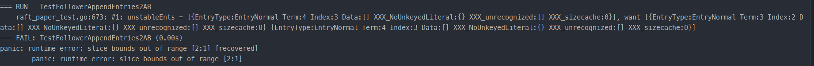
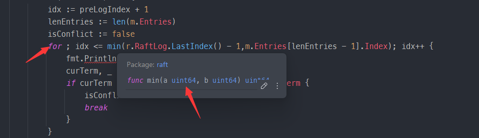

## 本周进度

完成并通过 Project2A

## 难点

1. 理解 Raft 算法。虽然论文中对 Raft 算法的讲述比较详尽，但是涵盖的内容很多，并且中文版本的论文涉及翻译问题，很难一次就理解个大概。

   > 动画演示很有用，结合动画演示可以很好地帮助理解 Raft 算法。

2. 项目代码框架的理解。涉及的结构体很多，结构体中字段很多，方法很多，初次看到代码非常头疼，几乎不知从何做起。

   > 把握三个子任务：领导者选举（Project 2aa）、实现日志复制（Project 2ab）、实现原始节点接口（Project 2ac），先实现 Project 2aa 和 2ab，最后实现 2ac。
   >
   > ---
   >
   > 很大的工作量在 Project 2aa 和 2ab。开始实现前，结合论文，搞懂 `RaftLog` 、`Raft`、 `Message`、`Entry`、`Progress`、`Storage`分别是做什么的，里面的字段分别有什么含义，哪些字段是我们需要用到的。
   >
   > ---
   >
   > `MessageType` 将消息划分成了若干类型，理清 `Leader`、`Candidate`、`Follower`分别需要处理哪些类型的消息。这又会将任务划分成了若干个子任务，我们可以各个击破，这样实现起来思路就比较清晰了。

3. 代码实现的细节。需要考虑的情况很多，比如 节点投票的条件，节点状态转换的时机，发送Message需要维护的字段，日志条目索引和切片下标的对应，极端情况的处理（比如网络中只有唯一一个节点）等等。

   > 结合论文，结合报错信息和测试信息，多调试。

## 遇到的问题和解决办法

遇到的问题非常多，debug 花了很长时间，这里列举一些经典的问题。

1. 非Leader节点接收到MessageType_MsgHup消息时，会成为Candidate并发起投票，要考虑到网络中只有自己一个唯一节点的情况。同样地，处理 Leader 追加从上层应用接收到的新日志，并广播给 Follower 时，也要考虑到网络中只有自己一个唯一节点的情况。

> 根据Prs字段的len值获取节点的数量，当这种情况发生时，直接成为 Leader。

2. Candidate收集投票结果时，如果大部分的节点都拒绝，此时应该直接成为 Follower。

> 测试要求的逻辑是这样，可能测试是为了防止这个耗费资源，这个节点已经不可能成为leader了，就别想再尝试当选了。

3. 节点同步日志条目时，会发生舍弃自身冲突的日志强行与Leader日志同步的情况，这时候要更新一下 RaftLog 的 stabled 字段的值，因为可能有些日志已经被持久化到 storage 中，但是因为冲突被舍弃掉了。

> 日志同步时，将 stabled 字段的值更新为min(历史stabled值,发生冲突的 index 值 - 1)即可

4. 日志索引类型是 uint64 的，raft包中的min函数接受的参数和返回值也是 uint64 的，要注意下溢的发生。

> 在上图中，r.RaftLog.LastIndex() 返回的索引值包含0，此时减一会下溢为 INF，在取 min 时就会出错。

5. 节点收到同步日志条目的 Message 时，发送者一定是Leader，此时要注意更新自身的 Lead 字段。

> 节点收到同步日志条目的 Message 时，调用becomeFollower方法即可。

6. 处于StateLeader 状态的节点也要处理 MessageType_MsgAppend （同步日志条目）类型的消息。

> 节点虽然处于StateLeader状态但可能其任期已经过时，此时就可能收到新任Leader的同步日志条目请求。

## 感受

1. 理清整体思路再下手编码，尽量不要边写边想，尤其是面对工程量很大的任务。
2. 要有模块化的思维，某些通用的过程能抽取成函数方法就抽取成函数方法，减少代码的冗余的同时，也能让自己的思路更加清晰。
3. 注释很重要，不要相信自己的记忆力。再简单的过程方法，能写注释就写注释。

