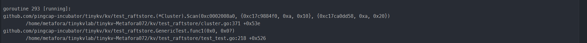
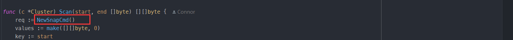
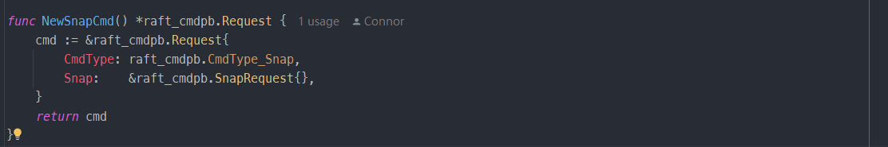
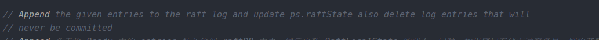
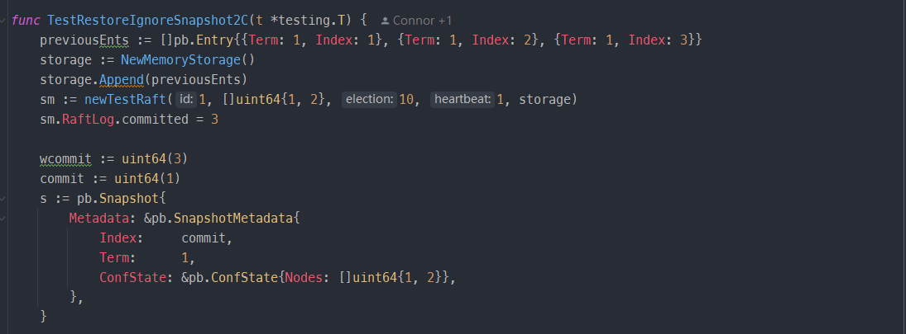
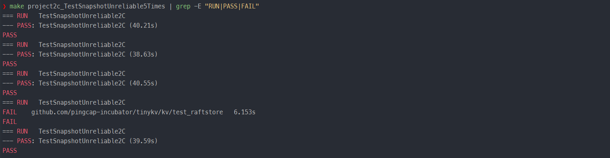

## 本周进度

完成并通过 **Project 2B**，**Project 2C**

## 难点

1. 理清 Project2B 中需要实现的部分和 Project2A 的关系。

> Project2A 实现了 Raft 协议，Project2B 要求在此基础上实现 KV 服务。我们需要根据客户端传来的命令请求 RaftCmdRequest，在proposeRaftCommand 方法中将其变成 entry 的 MessageType_MsgPropose 类型的消息传递给下层的 raft ，在project2A中进行同步。然后不断调用2A中实现的  HasReady 方法获取下层的 Ready，获取 Ready 后对其进行处理，包括发送raft消息、持久化状态、将提交的日志项应用到状态机。

2. 对于 Project2C，发送和应用 Snapshot 的整个过程比较复杂。

> 可以看参考的 TinyKV 白皮书，里面解释的非常详细。

3. 由于随机测试，很多错误可能需要测试很多遍才能够发现；并且对于2B 和 2C 的测试不像之前的测试瞬间就能跑完，需要花费一定的时间；再加上涉及到历史代码的修改和重构。整个调试过程比较痛苦。

> 要维持住心态，特别是当改着改着发现连 project2A 反而都出问题的时候。

4. 一些要处理的情形在参考文档中明确给出，但是测试却覆盖不到（下面会提到）。尽管这些情形不会影响实现 KV 的服务的正确性，但是会影响运行效率和资源浪费，所以有处理的必要。

> 多看参考文档的提示和要求，有些情形也会在代码的注释里提到。

## 遇到的问题及解决方案

1. 将客户端请求 RaftCmdRequest 包装成 entry 传递给 raft 层时，需要将 RaftCmdRequest 序列化为字节流，并调用 RaftGroup 的 Propose 方法，从而实现向 Raft 层发送一个 MessageType_MsgPropose 类型的请求。同理从 raft 层传来的 entry 也要反序列化得到相应的 RaftCmdRequest 请求。

> 项目代码提供了 Marshal 和 Unmarshal 方法。若是对序列化操作不熟悉的话，一开始可能会卡一下不知道怎么向 raft 层传递。

2. 在 Project2B 中，处理 RaftCmdRequest 时，也要处理 CmdType_Snap 类型的命令请求。尽管它的名称为 Snap，其实和 Project 2C 中的快照不是一个含义，它对应的其实是客户端的 RawScan 操作。

3. 在回复 proposal 时，对于过期的 proposal，要及时地将其从 proposals 列表中删除，防止这些过期的 proposal 在列表中堆积。

> 即使不这么做，也可以通过测试。但让过期的 proposal 一直在列表里堆积，会很影响后续遍历 proposals 列表的效率。
>
> 对将要处理的 entry 而言，Term 或是 Index 较小的 proposal 都属于过期的 proposal。所以在遍历 proposals 列表时，如果发现了 Term 和 Index 较小的 proposal，直接从列表中删除。

4. 将 Ready 中的 entries 持久化到 raftDB 中（Append 方法）时，如果底层存储有冲突条目，需要将其删除。

> 导致底层存储有冲突条目的原因是  Leader 发送新的日志条目时，可能会覆盖之前已经存在但未提交的条目。在将 entries 持久化到 raftDB 中时，可以获取当前 entries 的最新索引，那么凡是底层存储中拥有比这个最新索引更大的日志条目都是冲突的条目，使用 raftWB.DeleteMeta 方法将这些冲突的日志条目删除。
>
> 即使不这么做，也可以通过测试。但是为了防止这些冲突条目占用存储资源，删除掉是必要的。

5. `log.go` 中的 Term 方法要求返回指定索引日志条目的任期。如果考虑快照的话，相应日志可能在快照里，要通过 storage.Term 方法获取。

> storage.go 中的 MemoryStorage.ents 字段对相应信息进行了维护。

6. 节点处理快照消息请求（ MessageType_MsgSnapshot ）时，如果已经提交的日志大于等于快照中的日志，需要拒绝这次快照。因为已经 Commit 的日志最终会被 apply，如果强行更新为快照的状态，就会丢失已经提交的日志条目。

> 判断当前节点的 RaftLog 的 committed 字段和 message 的 Snapshot.Metadata.Index 的大小即可，如果前者更大，说明当前节点已经提交的日志大于等于快照中的日志，此时应该拒绝这个快照。

7. 在推进节点状态机（Advance方法）时，可能在上层发生了日志压缩，那么在内存中也应该丢弃这些被压缩了的日志（调用maybeCompact方法），防止这些日志在内存中不断堆积。

> 即使不这么做，也可以通过测试，但是放任不管让已经被压缩的日志在内存中不断堆积显然会非常影响效率。
>
> storage 的 Firstindex 方法会得到可以通过 Entries 获取的第一个日志条目的索引，在这索引之前的日志放在 Entry 里已经没有用了，将这些旧的日志丢弃掉即可。

8. 在推进节点状态机（Advance方法）时，要及时清空 pendingSnapshot。若忽略这点，TestSnapshotUnreliable2C 可能会检测到。

> 如果不及时清空 pendingSnapshot，HasReady 方法会一直返回 true，那么上层会一直认为有快照需要应用，造成不必要的处理。

## 心得

1. 重构代码时，能扩展就尽量别修改，有点类似SOLID原则中的开放封闭原则，尽量减少对历史正确代码的改动。
2. 某些地方，当前阶段可能只需要我们实现部分情形的任务，对其它情形可提前规划好框架或者是做好标注，方便未来快速定位。

> 比如当前我们只需要处理 client 发来的 AdminCmdType_CompactLog 类型的 admin command，而 AdminCmdType_ChangePeer、AdminCmdType_TransferLeader、AdminCmdType_Split 类型的 admin command 显然是后续任务需要实现的。

