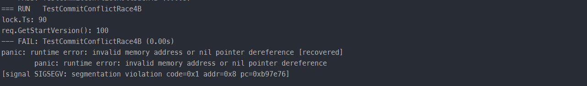
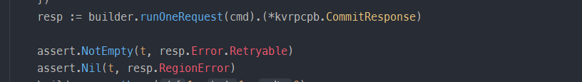
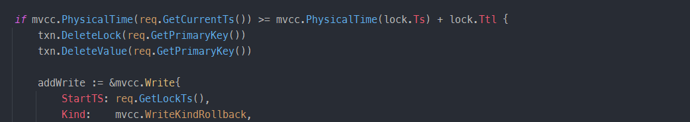
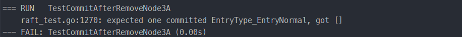
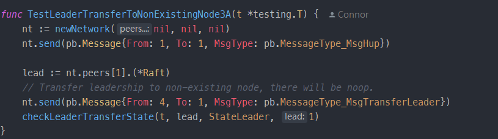

## 本周进度

完成并通过 **Project 4A、4B、4C、3A**

## 任务说明

`Project 4` 整体难度相对来说比较友好。在基本理解了两阶段提交协议 percolator，熟悉整个事务执行流程之后，就可以开始实现了。

> 有很多细节需要注意。可以参考文档中的提示（处理 RegionError、Scan过程的错误处理、如何计算超时等），也可以参考测试反馈结果。实现过程中个人遇到的一些细节错误会在下面说明。

`Project 3A` 要求实现单个 Raft 结点的增减以及领导者变更，需要添加和改动的代码不多，并且参考文档对整个过程要点解释得很详细，所以实现起来也基本顺利。

## 遇到的问题及解决方案

1. 文档中的提示明确提到，任何请求都有可能导致 region error，要考虑 region error 并在其发生时反馈给客户端。但是测试中却不会发生这种情况（相反，测试程序会检查你是否发生了 region error，如果发生了测试程序会不通过），意味着即使不考虑 region error 也可以通过 project 4。

> 按照提示要求，对于每个可能的请求，都去判定返回的 err 是否可能是 region error 是比较稳妥的。如果发生了 region error，更新XXXresponse 里的 RegionError 字段，然后直接返回 XXXresponse。

2. 在 KvCommit 函数中，获取每一个 key 的 lock 时，要检查 lock.Ts 是否等于当前事务的开始时间戳。如果不等于要直接终止。

> lock.Ts 不等于当前事务的开始时间戳，说明这个 lock 不是属于当前事务的。在后续实现的过程中可以更清晰地认识到，这种情况之所以发生，是因为预期的 lock 已经超时，被其它事务 Rollback 了，此时获取到的 lock 已经是其它事务的了。
>
> 
>
> 在 TestCommitConflictRace4B 这个测试点描述了这一种情况。根据测试代码可知，此时预期返回一个封装有非空 Retryable 字段 Error 的 response。

3. 在  KvCheckTxnStatus 方法中要计算超时时间，对于 lock.Ttl ，不需要对其使用 PhysicalTime 函数。

> lock.Ttl 本身就代表物理时间间隔，transaction.go 中的 PhysicalTime 函数是对时间戳进行处理，提取出其物理时间部分。

4. （3A）在 removeNode 时，要处理可能发生的日志提交。

> 当相应日志满足其存在于大部分结点的条件时，该日志会提交。对于一个不满足提交条件的日志，显然如果集群中少了一个结点，该日志可能就满足条件了。TestCommitAfterRemoveNode3A 测试点描述了这种情形。
>
> 

5. （3A）Leader 收到 MessageType_MsgTransferLeader 要求变更领导者的时候，要判断发送者是否合法（是否还存在于集群中），如果发送者已经不再集群中，则不需要响应此次请求。

> 测试点 TestLeaderTransferToNonExistingNode3A 描述了此种情形。Raft 的 Progress 字段可以描述当前集群的所有结点，可以通过判断 Progress[m.From] 是否存在来判断是否发生了此种情形。
>
> 

6. （3A）在 Leader 收到上层请求条目消息（ MessageType_MsgPropose）时，此时 Leader 可能正处于领导者变更的状态，这意味着它可能将不再是 Leader 了，此时要停止接收新的上层请求。

> 在 Leader 处理 MessageType_MsgPropose 消息时，判断其 leadTransferee 字段是否为空，如果不为空表明其正处于领导者变更的状态，直接返回即可。