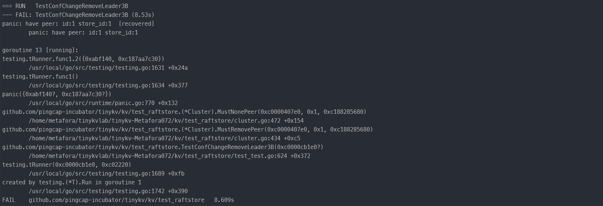
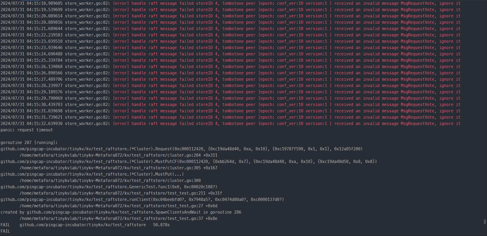
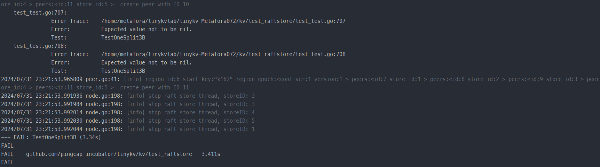
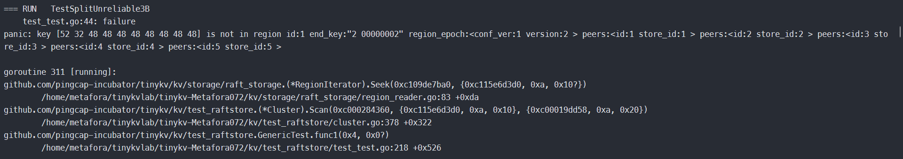

## 本周进度

**Project3B** : TransferLeader通过测试，ConfChange 还有3个测试点报 request timeout 错误，Split 后5个测试点会报 key is not in region 错误。

|   测试点类型   |                          测试点名称                          |         测试情况 / 10TESTS          |                  错误类型                  |
| :------------: | :----------------------------------------------------------: | :---------------------------------: | :----------------------------------------: |
| TransferLeader |                     TestTransferLeader3B                     | <font color=Green>**10PASS**</font> |                                            |
|   ConfChange   |                    TestBasicConfChange3B                     | <font color=Green>**10PASS**</font> |                                            |
|   ConfChange   |                 TestConfChangeRemoveLeader3B                 | <font color=Green>**10PASS**</font> |                                            |
|   ConfChange   |                   TestConfChangeRecover3B                    | <font color=Green>**10PASS**</font> |                                            |
|   ConfChange   |              TestConfChangeRecoverManyClients3B              | <font color=Green>**10PASS**</font> |                                            |
|   ConfChange   |                  TestConfChangeUnreliable3B                  | <font color=Red>**1~2FAIL**</font>  |              request timeout               |
|   ConfChange   |              TestConfChangeUnreliableRecover3B               | <font color=Red>**1~2FAIL**</font>  |              request timeout               |
|   ConfChange   |          TestConfChangeSnapshotUnreliableRecover3B           | <font color=Red>**1~2FAIL**</font>  |              request timeout               |
|   ConfChange   | TestConfChangeSnapshotUnreliableRecoverConcurrentPartition3B | <font color=Green>**10PASS**</font> |                                            |
|     Split      |                        TestOneSplit3B                        | <font color=Green>**10PASS**</font> |                                            |
|     Split      |                      TestSplitRecover3B                      | <font color=Green>**10PASS**</font> |                                            |
|     Split      |                TestSplitRecoverManyClients3B                 | <font color=Red>**2~4FAIL**</font>  |            key is not in region            |
|     Split      |                    TestSplitUnreliable3B                     | <font color=Red>**2~4FAIL**</font>  |            key is not in region            |
|     Split      |                 TestSplitUnreliableRecover3B                 | <font color=Red>**1~3FAIL**</font>  |            key is not in region            |
|     Split      |        TestSplitConfChangeSnapshotUnreliableRecover3B        | <font color=Red>**1~3FAIL**</font>  |            key is not in region            |
|     Split      | TestSplitConfChangeSnapshotUnreliableRecoverConcurrentPartition3B | <font color=Red>**1~3FAIL**</font>  | request timeout       key is not in region |

**Project3C** : 实现并通过测试。

 ## 实现思路

### Project 3B

3B 需要实现 `CompactLog`、`TransferLeader`、`ChangePeer`、`Split`四种 AdminRequest。其中`CompactLog` 我们已经在 Project2C 实现。所以需要我们实现的就是 `TransferLeader`、`ChangePeer`、`Split`这三种 AdminRequest。

#### TranferLeader

这个Request实现的比较简单，在`peer_msg_handler.go`中的`proposeRaftCommand`方法中添加对TranferLeader类型AdminRequest的处理，根据文档提示：

>This step is quite simple. As a raft command, `TransferLeader` will be proposed as a Raft entry. But `TransferLeader` actually is an action with no need to replicate to other peers, so you just need to call the `TransferLeader()` method of `RawNode` instead of `Propose()` for `TransferLeader` command.
>
>这一步非常简单。作为一个 Raft 命令，TransferLeader 将作为一个 Raft 条目被提议。但 TransferLeader 实际上是一个无需复制到其他对等节点的操作，因此只需调用 RawNode 的 TransferLeader() 方法而不是 Propose() 来执行 TransferLeader 命令。

直接调用 RawNode 的 TransferLeader() 方法即可。至于具体领导者变更的过程，我们已经在 Project3A 实现了。

#### ChangePeer

在`peer_msg_handler.go`中的`proposeRaftCommand`方法中添加对ChangePeer类型AdminRequest的处理。注意前一步成员变更被应用之后才可以执行下一步成员变更。紧接着创建相应的 proposal，调用d.RaftGroup.ProposeConfChange() 方法。

> 如果d.peerStorage.AppliedIndex() < d.RaftGroup.Raft.PendingConfIndex 表明上一次成员变更还没有应用

接下来考虑如何应用ChangePeer，`HandleRaftReady`方法处理 rawNode 传递来的 Ready,对这些 entries 进行 apply。对于当前需要 apply 的 entry，反序列化（unMarshal）得到相应的 RaftCmdRequest。

> entry 结构体有一个 EntryType 字段，如下：
>
> ```go
> const (
>  EntryType_EntryNormal     EntryType = 0
>  EntryType_EntryConfChange EntryType = 1
> )
> ```
>
> 这里有一个问题，对于ChangePeer类型Request的处理。我们可以根据 entry 的 EntryType 是否是 EntryType_EntryConfChange 来判断，也可以根据 entry 反序列化后得到的 RaftCmdRequest，其 request 的 AdminRequest.CmdType 是否是 AdminCmdType_ChangePeer 来判断，应该采用哪种判断方式？

根据参考文档中的提示：

> 测试代码会多次安排一个 conf change 的命令，直到该 conf change 被应用，所以你需要考虑如何忽略同一 conf change 的重复命令。

所以我们应当检查 Command Request 中的 RegionEpoch 是否是过期的，以此判定是不是一个重复的请求。我们调用 util.CheckRegionEpoch 方法，根据返回 err 是否是 ErrEpochNotMatch 类型来判断。如果是一个 ErrEpochNotMatch 类型的 err，表明 Command Request 中的 RegionEpoch 是过期的，就直接处理该 entry 的 proposal （调用 processProposal） ，将该操作的执行结果（RaftCmdResponse）封装为相应的错误响应即可。

如果 Command Request 中的 RegionEpoch 不是过期的，那么根据 confChange 的 ChangeType 来分别处理。有两种类型，一是ConfChangeType_AddNode（添加一个结点），二是ConfChangeType_RemoveNode（删除一个结点）。

---

##### ConfChangeType_AddNode（添加一个结点）：

对于添加结点，要判断**待添加的结点是否在集群中已存在**。

> ConfChange.NodeId 是待添加的结点编号。我们遍历 d.peerStorage.region.Peers。对于遍历的每一个 peer，使用 GetId() 获取其编号，如果该编号等于待添加的结点编号，说明待添加的结点是否在集群中已存在。如果每个 peer 的编号都与其不同，说明待添加的结点不存在于集群中。

只有待添加的结点是否在集群中不存在时，才是一个合法的添加结点操作。具体地，我们应该：

1. 在 region 中添加新的 peer，即添加 peer 到 region 的 Peers 切片中

2. 根据参考文档提示，增加 RegionEpoch 的 conf_ver

3. 调用 meta.WriteRegionState 方法更新结点的 PeerState 为 PeerState_Normal
4. 更新 metaStore 中的 region 信息
5. 调用 insertPeerCache 方法更新 peerCache

> ```go
> // Cache the peers information from other stores
> // when sending raft messages to other peers, it's used to get the store id of target peer
> // 缓存来自其他存储的节点信息
> // 在向其他节点发送 Raft 消息时，用于获取目标节点的存储 ID
> // (Used in 3B conf change)
> peerCache map[uint64]*metapb.Peer

##### ConfChangeType_RemoveNode（删除一个结点）:

对于删除结点，要判断**待删除的结点是否在集群中**。很显然，待删除的结点必须存在于集群中才是一个合法的操作。

> 同 AddNode 判断一样，遍历 d.peerStorage.region.Peers 判断。（见上文）

之后，我们应该：

1. 在 region 中删除指定的 peer， 即在 region 的 Peers 切片中移除相应的 peer
2. 根据参考文档提示，增加 RegionEpoch 的 conf_ver
3. 调用 meta.WriteRegionState 方法更新结点的 PeerState 为 PeerState_Normal
4. 更新 metaStore 中的 region 信息
5. 调用 removePeerCache 方法更新 peerCache

---

处理完 AddNode/RemoveNode 之后，我们根据参考文档提示，调用 raft.RawNode 的 ApplyConfChange()，目的是更新 raft 层的配置信息。

之后处理 proposal，即找到相应的回调，存入操作的执行结果（resp）。

最后，根据参考文档提示，对于执行 `AddNode`，新添加的 Peer 将由领导者的心跳来创建。

#### Split

在`peer_msg_handler.go`中的`proposeRaftCommand`方法中添加对 Split 类型AdminRequest的处理。定位到 processAdminRequest 方法中。

1. 判断收到的 Region Split 请求是否是一条过期的请求

2. 判断 splitKey 是否在目标 region 中
3. 创建 proposal,将请求提交到 raft

考虑如何应用 Split，`HandleRaftReady`方法处理 rawNode 传递来的 Ready,对这些 entries 进行 apply。对于当前需要 apply 的 entry，反序列化（unMarshal）得到相应的 RaftCmdRequest。raft_cmdpb.AdminCmdType_Split 类型的 AdminRequest 是我们需要应用的。

首先要判断**请求的 RegionId 和 peerMsgHandler 的 RegionId 是否一致**。（根据参考文档提示，要处理 ErrRegionNotFound 错误）。

之后要判断**收到的 Region Split 请求是否是一条过期的请求**（根据参考文档提示，要处理 ErrEpochNotMatch 错误）。

之后要判断**splitKey是否在 oldRegion中**，因为我们是根据 splitKey 将原 oldRegion 分割成两个 Region，所以 splitKey 肯定要在 oldRegion 的范围内。（根据参考文档，要处理 ErrKeyNotInRegion 错误）。

然后，根据参考文档提示，RegionEpoch 的 conf_ver 在 ConfChange 期间增加，而版本在分裂期间增加。因此我们要增加 RegionEpoch 版本。

然后，我们考虑创建新的 Region。

创建完成后，我们需要更新 storeMeta 的信息。注意除了上文中的更新 regions 映射外，还需要更新 d.Region 的 EndKey，并且要调用 `storeMeta.regionRanges.Delete` 方法在 B 树中删除原来的 oldRegion，调用`storeMeta.regionRanges.ReplaceOrInsert`方法把 newRegion 和更新范围了的 oldRegion 添加到 B 树中。

然后，调用 meta.WriteRegionState 方法持久化 oldRegion 和 newRegion。

再之后，根据参考文档提示，调用 createPeer 方法创建当前 store 上的 newRegion Peer，注册到 router，并启动

之后处理 proposal，即找到相应的回调，存入操作的执行结果（resp）。

最后，发送 heartbeat 给其他节点 (白皮书指导)。

## 遇到的问题

1. 在实现 ConfChange 部分时，测试会报 `wrong wireType = 0 for field Header` 错误。

> 不断打 log 发现是应用 ConfChange 日志条目时出现了这个错误。最后发现是反序列化时出现了问题。当前待应用的 entry 是 ConfChange 类型的 entry 时，对 entry.Data 进行反序列化可以得到相应的 ConfChange 结构体，然后对这个 ConfChange 结构体的 Context 字段再反序列化才能得到相应的 RaftCmdRequest。

2. 在实现 ConfChange 部分时，`TestConfChangeRemoveLeader3B` 测试点有很大概率报 `have peer（1,1）` 问题。看测试逻辑，首先这个测试点会先创建一个五个节点的集群，然后将领导者转移给（1,1），之后将这个领导者（1,1）从集群中移除掉。但是 MustNonePeer 函数检查（1,1）节点还存在于集群中。



> 一开始以为是 removeNode 的逻辑写得有问题，但是最后发现是 3A 写的有问题。当一个 Leader 变成 Follower 时，要及时得清空自己的 leadTransferee 字段。因为你已经不再是 Leader 了，你的 leadTransferee 字段就没有意义了，如果此时不清空该字段的话，可能就会产生一些潜在的问题。
>
> 添加了这个处理后，这个测试点就能正常 PASS 了。

3. ConfChange部分目前还有`TestConfChangeUnreliable3B`、`TestConfChangeUnreliableRecover3B`、`TestConfChangeSnapshotUnreliableRecover3B` 三个测试点会出现 request timeout 问题。（测十次大概有 1~2 次出现 request timeout）。
4. 在跑测试的时候，相当大部分的测试都会出现类似下图的 error log ： `received an invalid message XXX，ignore it`。但是遇见这个问题的测试点中，大部分最终测试结果都是 PASS 的，只有一小部分情形，这种 error log 会大量出现并可能因此导致 request timeout 错误。

> 根据报错信息来看，可能是 region epoch 没有配置好，具体原因还在排查中。



5. Split 部分的第一个测试点 `TestOneSplit3B` 有概率FAIL（报 Expected value not to be nil.错误）。（测十次大概有一两次）



> 具体原因未知，在 ProposeRaftCommand 方法中，对普通请求（Get、Put、Delete），添加了 CheckKeyInRegion，如果 key not in region，就直接返回 client 相应错误而不将该请求传递给下层，就不会报这个错误了（测了大概五十次 TestOneSplit3B 都能正常 PASS）。

6. Split 部分后面都会报如下图的 `key is not in region` 错误，但是确实也写了 CheckKeyInRegion 的相关逻辑。这个错误只是遇到了做了记录，还没开始排查具体原因。准备把 ConfChange 部分的问题搞得差不多再来搞这个。



7. Split 部分除了有  `received an invalid message XXX，ignore it` 的 error log，还遇见了`unsupported worker.Task: &{RegionId:XXX StartKey:[XXX] EndKey:[]}`、`[region XXX] send message failed message region_id:XXX from_peer:<id:XXX store_id:XXX > to_peer:<id:XXX store_id:XXX> region_epoch:<conf_ver:XXX version:XXX > is_tombstone:true  is dropped` 的 error log，也在此先记录一下。