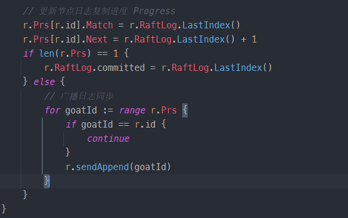
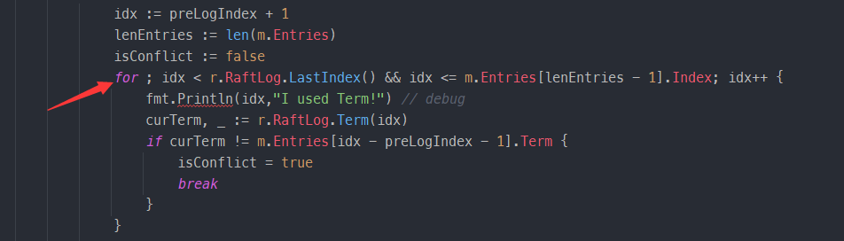

## 记录

**storage** 结构体是什么？

`firstindex`和`lastindex`的开闭情况？


为什么要减去`firstindex`？


为什么leader要在自己的任期内提交一个空的操作条目？


`handleStartElection`方法的特殊情况


handleRequestVoteResponse 节点收到 RequestVote 时候的处理，如果节点拒绝了且拒绝者的任期比较高，不直接变成follower会怎样？


handlePropose Leader 追加从上层应用接收到的新日志，并广播给 Follower.如果不处理节点只有一个的特殊情况会怎样？



`handleAppendEntries` 中，如果没判断len(entries)会怎样？ 如果没更新stabled会怎样？appendEntry的下标要注意


`handleAppendEntries` 中，这里应该是-1，如果写成+1？


`handleAppendEntries` 中，r.RaftLog.commited直接更新为m.Commit会怎样？


`handleHeartbeat`方法中，如果不维护Commit会怎样？


## 评测记录


`TestFollowerVote2AA` FAIL

Solution:	handleRequestVote方法的应答msgType不是pb.MessageType_MsgRequestVote，而是pb.MessageType_MsgRequestVoteResponse


`TestLeaderElection2AA` FAIL

Solution: raft的min函数只能处理uint64类型,Lastindex为0时，减1会发生下溢，变为inf




`handleRequestVoteResponse`中为什么这个需要？


## 相关代码

`raft/log.go`中 **RaftLog** 结构体：

```go
// 存储raft的日志信息，负责存储和维护所有未被截断的日志条目，并确保日志的一致性和持久性。
type RaftLog struct {
	// 存储包含自上次快照以来的所有稳定条目
	storage Storage

	// 已知已提交的最高的日志条目的索引     committedIndex
	committed uint64

	// 已经被应用到状态机的最高的日志条目的索引 appliedIndex
	applied uint64

	// stabled 保存的是已经持久化到 storage 的 index
	stabled uint64

	// 保存所有尚未压缩的日志条目
	entries []pb.Entry

	// 保存任何传入的不稳定快照，在应用快照到状态机时使用。
	pendingSnapshot *pb.Snapshot

	// Your Data Here (2A).
}
```

`raft/storage.go`中 **Storage** 接口：

```go
type Storage interface {
	// 返回保存的 HardState 和 ConfState 信息。
	InitialState() (pb.HardState, pb.ConfState, error)
	// 返回范围 [lo, hi) 内的日志条目切片。
	Entries(lo, hi uint64) ([]pb.Entry, error)
	// 返回索引 i 处条目的任期。保留 FirstIndex 之前条目的任期以用于匹配，即使该条目的其余部分不可用。
	Term(i uint64) (uint64, error)
	// 返回日志中最后一个条目的索引。
	LastIndex() (uint64, error)
	// 返回可能通过 Entries 方法获取的第一个日志条目的索引。较旧的条目可能已被合并到最新的快照中，因此不可用。
	FirstIndex() (uint64, error)
	// 返回最新的快照，如果快照暂时不可用，应返回 ErrSnapshotTemporarilyUnavailable，表明存储需要一些时间来准备快照，并稍后调用 Snapshot 方法。
	Snapshot() (pb.Snapshot, error)
}
```

`proto/pkg/eraftpb.go` 中 **MessageType**:

```go
const (
	// 'MessageType_MsgHup' is a local message used for election. If an election timeout happened,
	// the node should pass 'MessageType_MsgHup' to its Step method and start a new election.
    // Local Msg，用于请求节点开始选举
	MessageType_MsgHup MessageType = 0
	// 'MessageType_MsgBeat' is a local message that signals the leader to send a heartbeat
	// of the 'MessageType_MsgHeartbeat' type to its followers.
    // Local Msg，用于告知 Leader 该发送心跳了
	MessageType_MsgBeat MessageType = 1
	// 'MessageType_MsgPropose' is a local message that proposes to append data to the leader's log entries.
    // Local Msg，用于上层请求 propose 条目，即追加从上层应用接收到的新日志
	MessageType_MsgPropose MessageType = 2
	// 'MessageType_MsgAppend' contains log entries to replicate.
    // Common Msg，用于 Leader 给其他节点同步日志条目
	MessageType_MsgAppend MessageType = 3
	// 'MessageType_MsgAppendResponse' is response to log replication request('MessageType_MsgAppend').
    // Common Msg，用于节点告诉 Leader 日志同步是否成功，和 MsgAppend 对应，
	MessageType_MsgAppendResponse MessageType = 4
	// 'MessageType_MsgRequestVote' requests votes for election.
    // Common Msg，用于 Candidate 请求投票，
	MessageType_MsgRequestVote MessageType = 5
	// 'MessageType_MsgRequestVoteResponse' contains responses from voting request.
    // Common Msg，用于节点告诉 Candidate 投票结果，
	MessageType_MsgRequestVoteResponse MessageType = 6
	// 'MessageType_MsgSnapshot' requests to install a snapshot message.
    // Common Msg，用于 Leader 将快照发送给其他节点，Project2C 中使用。
	MessageType_MsgSnapshot MessageType = 7
	// 'MessageType_MsgHeartbeat' sends heartbeat from leader to its followers.
    // Common Msg，即 Leader 发送的心跳。不同于论文中使用空的追加日志 RPC 代表心跳，TinyKV 给心跳一个单独的 MsgType。
	MessageType_MsgHeartbeat MessageType = 8
	// 'MessageType_MsgHeartbeatResponse' is a response to 'MessageType_MsgHeartbeat'.
    // Common Msg，即节点对心跳的回应。
	MessageType_MsgHeartbeatResponse MessageType = 9
	// 'MessageType_MsgTransferLeader' requests the leader to transfer its leadership.
    // Local Msg，用于上层请求转移 Leader，Project3 使用。
	MessageType_MsgTransferLeader MessageType = 11
	// 'MessageType_MsgTimeoutNow' send from the leader to the leadership transfer target, to let
	// the transfer target timeout immediately and start a new election.
    // Local Msg，节点收到后清空 r.electionElapsed，并即刻发起选举
	MessageType_MsgTimeoutNow MessageType = 12
)
```

`proto/pkg/eraftpb.go`中 **Message** 结构体：

```go
type Message struct {
  	// 消息类型，表示消息的具体类型（如请求投票、追加日志等）。
	MsgType              MessageType 
    // 消息的目标节点 ID。
	To                   uint64      `protobuf:"varint,2,opt,name=to,proto3" json:"to,omitempty"`
    // 消息的发送节点 ID。
	From                 uint64      `protobuf:"varint,3,opt,name=from,proto3" json:"from,omitempty"`
    // 当前任期号，用于领导选举和日志一致性。
	Term                 uint64      `protobuf:"varint,4,opt,name=term,proto3" json:"term,omitempty"`
    // 日志条目的任期号，用于日志一致性检查。
	LogTerm              uint64      `protobuf:"varint,5,opt,name=log_term,json=logTerm,proto3"`
	// 日志条目的索引，用于标识日志的位置。
	Index                uint64      `protobuf:"varint,6,opt,name=index,proto3" json:"index,omitempty"`
    // 日志条目数组，包含多个日志条目。
	Entries              []*Entry    `protobuf:"bytes,7,rep,name=entries" json:"entries,omitempty"`
    // 已提交的最高日志条目的索引。
	Commit               uint64      `protobuf:"varint,8,opt,name=commit,proto3" json:"commit,omitempty"`
    // 快照数据，用于状态机的快照。
	Snapshot             *Snapshot   `protobuf:"bytes,9,opt,name=snapshot" json:"snapshot,omitempty"`
    // 表示是否拒绝该消息（如拒绝投票请求）
	Reject               bool        `protobuf:"varint,10,opt,name=reject,proto3" json:"reject,omitempty"`
    
	XXX_NoUnkeyedLiteral struct{}    `json:"-"`
	XXX_unrecognized     []byte      `json:"-"`
	XXX_sizecache        int32       `json:"-"`
}
```

`raft/raft.go` 中的 **Progress** 结构：

```go
type Progress struct {
	// 表示 Follower 节点已经复制的日志条目的最高索引。Leader 使用这个字段来跟踪每个 Follower 的日志复制进度。
    Match uint64
    // 表示 Leader 需要发送给 Follower 的下一个日志条目的索引。Leader 使用这个字段来决定从哪里开始发送新的日志条目。
    Next uint64
}
```

`raft/raft.go` 中的 **Raft** 类型：

```go
type Raft struct {
	// 节点的唯一标识符
	id uint64

	// 当前任期号
	Term uint64
	// 当前任期内投票给的候选人ID
	Vote uint64


	// 指向日志结构的指针，存储所有的日志条目。
	RaftLog *RaftLog


	// 每个节点的日志复制进度，键是节点ID，值是进度信息。
	Prs map[uint64]*Progress


	// 当前节点的角色状态（如领导者、候选人、跟随者）。
	State StateType


	// 记录当前任期内收到的投票情况，键是节点ID，值是是否投票。
	votes map[uint64]bool


	// 需要发送的消息列表。
	msgs []pb.Message


	// 当前领导者的ID。
	Lead uint64


	// 心跳间隔时间，领导者定期发送心跳。
	heartbeatTimeout int

	// 选举超时时间的基准值。
	electionTimeout int

	// 自上次心跳超时以来经过的时间，仅领导者维护。
	heartbeatElapsed int

	// 自上次选举超时或收到当前领导者的有效消息以来经过的时间。
	electionElapsed int


	// 领导者转移目标的ID，当其值不为零时表示正在进行领导者转移。
	leadTransferee uint64


	// 当前待处理的配置变更的日志索引，仅允许一个配置变更待处理。
	PendingConfIndex uint64

	// 随机超时选举，[electionTimeout, 2*electionTimeout)[150ms,300ms]
	randomElectionTimeout int
}
```

`proto/pkg/eraftpb.go` 中的 **Entry** 类型：

```go
type Entry struct {
    // 表示日志条目的类型，可以是普通条目或配置变更条目。
	EntryType            EntryType 
    // 日志条目所属的任期。
	Term                 uint64    `protobuf:"varint,2,opt,name=term,proto3" json:"term,omitempty"`
	// 日志条目的索引。
    Index                uint64    `protobuf:"varint,3,opt,name=index,proto3" json:"index,omitempty"`
	// 日志条目的数据，对于普通条目，这里存储的是需要应用的数据变更；对于配置变更条目，这里存储的是 ConfChange 消息。
    Data                 []byte    `protobuf:"bytes,4,opt,name=data,proto3" json:"data,omitempty"`
	XXX_NoUnkeyedLiteral struct{}  `json:"-"`
	XXX_unrecognized     []byte    `json:"-"`
	XXX_sizecache        int32     `json:"-"`
}
const (
	EntryType_EntryNormal     EntryType = 0 // 普通条目
	EntryType_EntryConfChange EntryType = 1 // 配置变更条目
)
```

