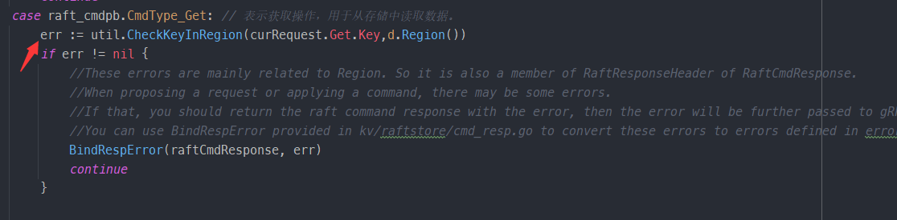
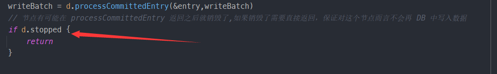
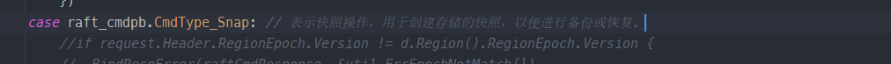
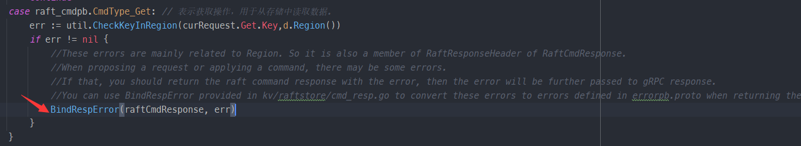

## 记录

`processRequest`中，处理请求时不检查key是否在region中会怎样?



`HandleRaftReady`中，如果不判断stopped会怎样？



`processRequest`中，CmdType_Snap 类型的操作在2B中也要处理



## 问题

什么是message的序列化？反序列化？	



什么是WriteBatch？

callback的机制？

kvWB和raftWB？为什么有kv和raft两个Engine？

**Peer**

```go
type peer struct {
	// The ticker of the peer, used to trigger
	// * raft tick
	// * raft log gc
	// * region heartbeat
	// * split check
	ticker *ticker
	// Instance of the Raft module
	RaftGroup *raft.RawNode
	// The peer storage for the Raft module
	peerStorage *PeerStorage

	// Record the meta information of the peer
	Meta     *metapb.Peer
	regionId uint64
	// Tag which is useful for printing log
	Tag string

	// Record the callback of the proposals
	// (Used in 2B)
	proposals []*proposal

	// Index of last scheduled compacted raft log.
	// (Used in 2C)
	LastCompactedIdx uint64

	// Cache the peers information from other stores
	// when sending raft messages to other peers, it's used to get the store id of target peer
	// (Used in 3B conf change)
	peerCache map[uint64]*metapb.Peer
	// Record the instants of peers being added into the configuration.
	// Remove them after they are not pending any more.
	// (Used in 3B conf change)
	PeersStartPendingTime map[uint64]time.Time
	// Mark the peer as stopped, set when peer is destroyed
	// (Used in 3B conf change)
	stopped bool

	// An inaccurate difference in region size since last reset.
	// split checker is triggered when it exceeds the threshold, it makes split checker not scan the data very often
	// (Used in 3B split)
	SizeDiffHint uint64
	// Approximate size of the region.
	// It's updated everytime the split checker scan the data
	// (Used in 3B split)
	ApproximateSize *uint64
}
```

**proposal**

```go
type proposal struct {
	// index + term for unique identification
	index uint64
	term  uint64
	cb    *message.Callback
}
```

**CmdType**

1. **`CmdType_Invalid` (值为 0)**: 表示无效的命令类型，通常用于初始化或错误处理。
2. **`CmdType_Get` (值为 1)**: 表示获取操作，用于从存储中读取数据。
3. **`CmdType_Put` (值为 3)**: 表示存储操作，用于将数据写入存储。
4. **`CmdType_Delete` (值为 4)**: 表示删除操作，用于从存储中删除数据。
5. **`CmdType_Snap` (值为 5)**: 表示快照操作，用于创建存储的快照，以便进行备份或恢复。

```go
type CmdType int32

const (
	CmdType_Invalid CmdType = 0
	CmdType_Get     CmdType = 1
	CmdType_Put     CmdType = 3
	CmdType_Delete  CmdType = 4
	CmdType_Snap    CmdType = 5
)
```

**Peerstorage**

```go
type PeerStorage struct {
	// current region information of the peer
	region *metapb.Region
	// current raft state of the peer
	raftState *rspb.RaftLocalState
	// current apply state of the peer
	applyState *rspb.RaftApplyState

	// current snapshot state
	snapState snap.SnapState
	// regionSched used to schedule task to region worker
	regionSched chan<- worker.Task
	// generate snapshot tried count
	snapTriedCnt int
	// Engine include two badger instance: Raft and Kv
	Engines *engine_util.Engines
	// Tag used for logging
	Tag string
}
```

**Callback**

```go
type Callback struct {
	Resp *raft_cmdpb.RaftCmdResponse
	Txn  *badger.Txn // used for GetSnap
	done chan struct{}
}
```