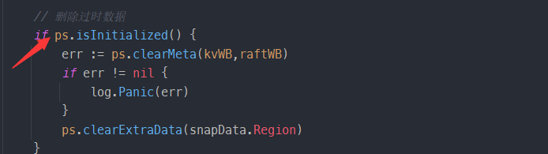
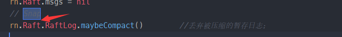
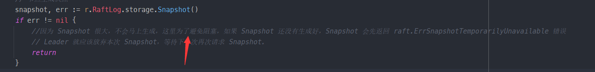

## 记录

`peer_storage.go`中的 ApplySnapshot，不判断isInit会怎样？



`rawnode.go`中的`Advance`方法记得丢弃被压缩的日志



`raft.go`中的`sendSnapshot`要处理快照还未生成好时的情况



**Snapshot**

```go
type Snapshot struct {
    // 字节切片，用于存储快照的数据。
	Data                 []byte            `protobuf:"bytes,1,opt,name=data,proto3" json:"data,omitempty"`
	// 用于表示快照的元数据信息。
    Metadata             *SnapshotMetadata `protobuf:"bytes,2,opt,name=metadata" json:"metadata,omitempty"`
	XXX_NoUnkeyedLiteral struct{}          `json:"-"`
	XXX_unrecognized     []byte            `json:"-"`
	XXX_sizecache        int32             `json:"-"`
}
```

**SnapshotMetadata**

```go
// SnapshotMetadata contains the log index and term of the last log applied to this
// Snapshot, along with the membership information of the time the last log applied.
type SnapshotMetadata struct {
	ConfState            *ConfState 
    // 应用到快照的最后一个日志的索引。
	Index                uint64  
    // 应用到快照的最后一个日志的任期。
	Term                 uint64     
	XXX_NoUnkeyedLiteral struct{}   
	XXX_unrecognized     []byte     
	XXX_sizecache        int32     
}

```