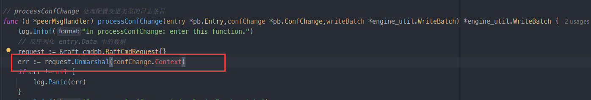
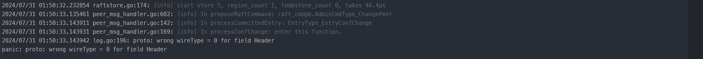
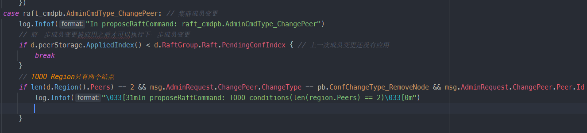
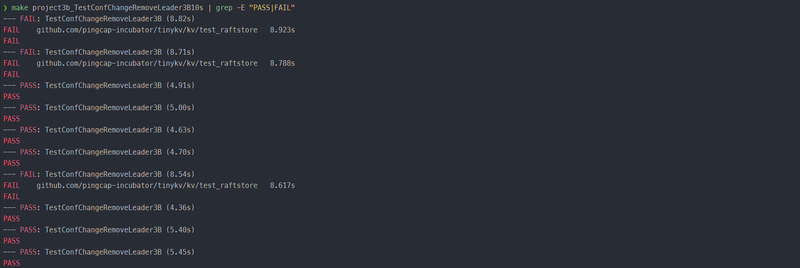
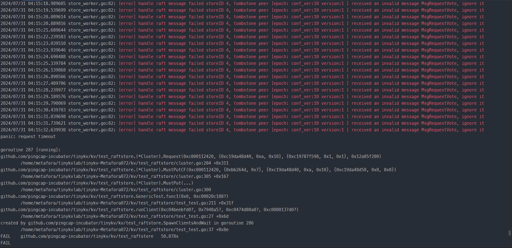
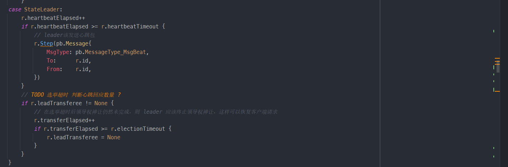
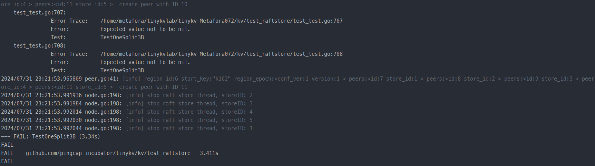

## 任务要求

由于 Raft 模块现在支持成员变更和领导变更，在这一部分中，你需要在 Part A 的基础上使 TinyKV 支持这些 admin 命令。你可以在 proto/proto/raft_cmdpb.proto 中看到，有四种 admin 命令：

- CompactLog (已经在 Project2 的 PartC 实现)
- TransferLeader
- ChangePeer
- Split

## 实现思路

1.  我们需要实现 `CompactLog`、`TransferLeader`、`ChangePeer`、`Split`四种 AdminRequest。其中`CompactLog` 我们已经在 Project2C 实现。所以需要我们实现的就是 `TransferLeader`、`ChangePeer`、`Split`这三种 AdminRequest。所以我们可以先去实现 `peer_msg_handler.go`中的`proposeRaftCommand`方法（将 client 的请求包装成 entry 传递给 raft 层）。

## TranferLeader

这个Request实现的比较简单，在`peer_msg_handler.go`中的`proposeRaftCommand`方法中添加对TranferLeader类型AdminRequest的处理，根据文档提示：

>This step is quite simple. As a raft command, `TransferLeader` will be proposed as a Raft entry. But `TransferLeader` actually is an action with no need to replicate to other peers, so you just need to call the `TransferLeader()` method of `RawNode` instead of `Propose()` for `TransferLeader` command.
>
>这一步非常简单。作为一个 Raft 命令，TransferLeader 将作为一个 Raft 条目被提议。但 TransferLeader 实际上是一个无需复制到其他对等节点的操作，因此只需调用 RawNode 的 TransferLeader() 方法而不是 Propose() 来执行 TransferLeader 命令。

直接调用 RawNode 的 TransferLeader() 方法即可。至于具体领导者变更的过程，我们已经在 Project3A 实现了。

## ChangePeer

>conf change有两种不同的类型：AddNode 和 RemoveNode。正如它的名字所暗示的，它添加一个 Peer 或从 region 中删除一个 Peer。为了实现 conf change，你应该先学习 RegionEpoch 的术语。RegionEpoch 是 metapb.Region 的元信息的一部分。当一个 Region 增加或删除 Peer 或拆分时，Region的poch就会发生变化。RegionEpoch 的 conf_ver 在 ConfChange 期间增加，而版本在分裂期间增加。它将被用来保证一个 Region 中的两个领导者在网络隔离下有最新的region信息。
>
>你需要使 raftstore 支持处理 conf change 命令。这个过程是：
>
>- 通过 ProposeConfChange 提出 conf change admin 命令
>- 在日志被提交后，改变 RegionLocalState，包括 RegionEpoch 和 Region 中的Peers。
>- 调用 raft.RawNode 的 ApplyConfChange()。
>
>提示：
>
>- 对于执行 `AddNode`，新添加的 Peer 将由领导者的心跳来创建，查看 `storeWorker` 的 `maybeCreatePeer()`。在那个时候，这个 Peer 是未初始化的，它的 region 的任何信息对我们来说都是未知的，所以我们用 0 来初始化它的日志任期`Log Term`和索引`Index`。这时领导者会知道这个跟随者没有数据（存在一个从0到5的日志间隙），它将直接发送一个快照给这个跟随者。
>- 对于执行 RemoveNode，你应该明确地调用 destroyPeer() 来停止 Raft 模块。销毁逻辑是为你提供的。
>- 不要忘记更新 GlobalContext 的 storeMeta 中的 region 状态。
>- 测试代码会多次安排一个 conf change 的命令，直到该 conf change 被应用，所以你需要考虑如何忽略同一 conf change 的重复命令。

在`peer_msg_handler.go`中的`proposeRaftCommand`方法中添加对ChangePeer类型AdminRequest的处理。注意前一步成员变更被应用之后才可以执行下一步成员变更。紧接着创建相应的 proposal，调用d.RaftGroup.ProposeConfChange() 方法。

> 如果d.peerStorage.AppliedIndex() < d.RaftGroup.Raft.PendingConfIndex 表明上一次成员变更还没有应用

接下来考虑如何应用ChangePeer，`HandleRaftReady`方法处理 rawNode 传递来的 Ready,对这些 entries 进行 apply。对于当前需要 apply 的 entry，反序列化（unMarshal）得到相应的 RaftCmdRequest。

> entry 结构体有一个 EntryType 字段，如下：
>
> ```go
> const (
>     EntryType_EntryNormal     EntryType = 0
>     EntryType_EntryConfChange EntryType = 1
> )
> ```
>
> 这里有一个问题，对于ChangePeer类型Request的处理。我们可以根据 entry 的 EntryType 是否是 EntryType_EntryConfChange 来判断，也可以根据 entry 反序列化后得到的 RaftCmdRequest，其 request 的 AdminRequest.CmdType 是否是 AdminCmdType_ChangePeer 来判断，应该采用哪种判断方式？

根据参考文档中的提示：

> 测试代码会多次安排一个 conf change 的命令，直到该 conf change 被应用，所以你需要考虑如何忽略同一 conf change 的重复命令。

所以我们应当检查 Command Request 中的 RegionEpoch 是否是过期的，以此判定是不是一个重复的请求。我们调用 util.CheckRegionEpoch 方法，根据返回 err 是否是 ErrEpochNotMatch 类型来判断。如果是一个 ErrEpochNotMatch 类型的 err，表明 Command Request 中的 RegionEpoch 是过期的，就直接处理该 entry 的 proposal （调用 processProposal） ，将该操作的执行结果（RaftCmdResponse）封装为相应的错误响应即可。

如果 Command Request 中的 RegionEpoch 不是过期的，那么根据 confChange 的 ChangeType 来分别处理。有两种类型，一是ConfChangeType_AddNode（添加一个结点），二是ConfChangeType_RemoveNode（删除一个结点）。

#### ConfChangeType_AddNode（添加一个结点）：

对于添加结点，要判断**待添加的结点是否在集群中已存在**。

> ConfChange.NodeId 是待添加的结点编号。我们遍历 d.peerStorage.region.Peers。对于遍历的每一个 peer，使用 GetId() 获取其编号，如果该编号等于待添加的结点编号，说明待添加的结点是否在集群中已存在。如果每个 peer 的编号都与其不同，说明待添加的结点不存在于集群中。

只有待添加的结点是否在集群中不存在时，才是一个合法的添加结点操作。具体地，我们应该：

1. 在 region 中添加新的 peer，即添加 peer 到 region 的 Peers 切片中

2. 根据参考文档提示，增加 RegionEpoch 的 conf_ver

3. 调用 meta.WriteRegionState 方法更新结点的 PeerState 为 PeerState_Normal
4. 更新 metaStore 中的 region 信息
5. 调用 insertPeerCache 方法更新 peerCache

> ```go
> // Cache the peers information from other stores
> // when sending raft messages to other peers, it's used to get the store id of target peer
> // 缓存来自其他存储的节点信息
> // 在向其他节点发送 Raft 消息时，用于获取目标节点的存储 ID
> // (Used in 3B conf change)
> peerCache map[uint64]*metapb.Peer
> ```

#### ConfChangeType_RemoveNode（删除一个结点）:

对于删除结点，要判断**待删除的结点是否在集群中**。很显然，待删除的结点必须存在于集群中才是一个合法的操作。

> 同 AddNode 判断一样，遍历 d.peerStorage.region.Peers 判断。（见上文）

之后，我们应该：

1. 在 region 中删除指定的 peer， 即在 region 的 Peers 切片中移除相应的 peer
2. 根据参考文档提示，增加 RegionEpoch 的 conf_ver
3. 调用 meta.WriteRegionState 方法更新结点的 PeerState 为 PeerState_Normal
4. 更新 metaStore 中的 region 信息
5. 调用 removePeerCache 方法更新 peerCache

处理完AddNode/RemoveNode之后，我们根据参考文档提示，调用 raft.RawNode 的 ApplyConfChange()，目的是更新 raft 层的配置信息。

之后处理 proposal，即找到相应的回调，存入操作的执行结果（resp）。

最后，根据参考文档提示，对于执行 `AddNode`，新添加的 Peer 将由领导者的心跳来创建。

## split

> 为了支持 multi-raft，系统进行了数据分片，使每个 raft 组只存储一部分数据。Hash 和 Range 是常用的数据分片方式。TinyKV 使用 Range，主要原因是 Range 可以更好地聚合具有相同前缀的key，这对扫描等操作来说很方便。此外，Range在分片上比 Hash 更有优势。通常情况下，它只涉及元数据的修改，不需要移动数据。
>
>```go
>message Region {
>	uint64 id = 1;
>	// Region key range [start_key, end_key).
>	bytes start_key = 2;
>	bytes end_key = 3;
>	RegionEpoch region_epoch = 4;
>	repeated Peer peers = 5
>}
>```
>
>让我们重新审视一下 Region 的定义，它包括两个字段 start_key 和 end_key，以表明 Region 所负责的数据范围。所以 Split 是支持多进程的关键步骤。在开始时，只有一个Region，其范围是[“”, “”)。你可以把 key 空间看作一个圈，所以[“”, “”)代表整个空间。随着数据的写入，分割检查器将在每一个 cfg.SplitRegionCheckTickInterval 检查 region 的大小，并在可能的情况下生成一个分割键，将该 region 切割成两部分，你可以在 kv/raftstore/runner/split_check.go 中查看其逻辑。分割键将被包装成一个 MsgSplitRegion，由 onPrepareSplitRegion() 处理。
>
>  为了确保新创建的 Region 和 Peers 的 id 是唯一的，这些 id 是由调度器分配的。onPrepareSplitRegion() 实际上为 pd Worker 安排了一个任务，向调度器索取id。并在收到调度器的响应后做出一个 Split admin命令，见kv/raftstore/runner/scheduler_task.go 中的 onAskSplit()。
>
>  所以你的任务是实现处理 Split admin 命令的过程，就像 conf change 那样。提供的框架支持 multi-raft，见 kv/raftstore/router.go。当一个 Region 分裂成两个 Region 时，其中一个 Region 将继承分裂前的元数据，只是修改其 Range 和 RegionEpoch，而另一个将创建相关的元信息。
>
>> 提示:
>>
>> - 这个新创建的 Region 的对应 Peer 应该由 createPeer() 创建，并注册到 router.regions。而 region 的信息应该插入 ctx.StoreMeta 中的regionRanges 中。
>> - 对于有网络隔离的 region split 情况，要应用的快照可能会与现有 region 的范围有重叠。检查逻辑在 kv/raftstore/peer_msg_handler.go 的checkSnapshot() 中。请在实现时牢记这一点，并照顾到这种情况。
>> - 使用 engine_util.ExceedEndKey() 与 region 的 end key 进行比较。因为当end key 等于"“时，任何 key 都将等于或大于”"。
>> - 有更多的错误需要考虑。ErrRegionNotFound, ErrKeyNotInRegion, ErrEpochNotMatch。

在`peer_msg_handler.go`中的`proposeRaftCommand`方法中添加对 Split 类型AdminRequest的处理。定位到 processAdminRequest 方法中。

1. 判断收到的 Region Split 请求是否是一条过期的请求

2. 判断 splitKey 是否在目标 region 中
3. 创建 proposal,将请求提交到 raft

考虑如何应用 Split，`HandleRaftReady`方法处理 rawNode 传递来的 Ready,对这些 entries 进行 apply。对于当前需要 apply 的 entry，反序列化（unMarshal）得到相应的 RaftCmdRequest。raft_cmdpb.AdminCmdType_Split 类型的 AdminRequest 是我们需要应用的。

首先要判断**请求的 RegionId 和 peerMsgHandler 的 RegionId 是否一致**。（根据参考文档提示，要处理 ErrRegionNotFound 错误）。

之后要判断**收到的 Region Split 请求是否是一条过期的请求**（根据参考文档提示，要处理 ErrEpochNotMatch 错误）。

之后要判断**splitKey是否在 oldRegion中**，因为我们是根据 splitKey 将原 oldRegion 分割成两个 Region，所以 splitKey 肯定要在 oldRegion 的范围内。（根据参考文档，要处理 ErrKeyNotInRegion 错误）。

然后，根据参考文档提示，RegionEpoch 的 conf_ver 在 ConfChange 期间增加，而版本在分裂期间增加。因此我们要增加 RegionEpoch 版本。

```go
d.Region().RegionEpoch.Version++
```

然后，我们考虑创建新的 Region。

创建完成后，我们需要更新 storeMeta 的信息。注意除了上文中的更新 regions 映射外，还需要更新 d.Region 的 EndKey，并且要调用 `storeMeta.regionRanges.Delete` 方法在 B 树中删除原来的 oldRegion，调用`storeMeta.regionRanges.ReplaceOrInsert`方法把 newRegion 和更新范围了的 oldRegion 添加到 B 树中。

然后，调用 meta.WriteRegionState 方法持久化 oldRegion 和 newRegion。

再之后，根据参考文档提示，调用 createPeer 方法创建当前 store 上的 newRegion Peer，注册到 router，并启动

之后处理 proposal，即找到相应的回调，存入操作的执行结果（resp）。

最后，发送 heartbeat 给其他节点 (白皮书指导)。

## 测试点反馈记录

|   测试点类型   |                          测试点名称                          |         测试情况 / 30TESTS          |                 错误类型                  |                           调试记录                           |
| :------------: | :----------------------------------------------------------: | :---------------------------------: | :---------------------------------------: | :----------------------------------------------------------: |
| TransferLeader |                     TestTransferLeader3B                     | <font color=Green>**30PASS**</font> |                                           |                                                              |
|   ConfChange   |                    TestBasicConfChange3B                     | <font color=Green>**30PASS**</font> |                                           |                                                              |
|   ConfChange   |                 TestConfChangeRemoveLeader3B                 | <font color=Green>**30PASS**</font> |                                           |                                                              |
|   ConfChange   |                   TestConfChangeRecover3B                    | <font color=Green>**30PASS**</font> |                                           |                                                              |
|   ConfChange   |              TestConfChangeRecoverManyClients3B              | <font color=Green>**30PASS**</font> |                                           |                                                              |
|   ConfChange   |                  TestConfChangeUnreliable3B                  | <font color=Green>**30PASS**</font> |              request timeout              | raft的handlePropose方法将leadTransferee判断提到方法开始处，解决 |
|   ConfChange   |              TestConfChangeUnreliableRecover3B               | <font color=Green>**30PASS**</font> |              request timeout              | raft的handlePropose方法将leadTransferee判断提到方法开始处，解决 |
|   ConfChange   |          TestConfChangeSnapshotUnreliableRecover3B           | <font color=Green>**30PASS**</font> |              request timeout              | raft的handlePropose方法将leadTransferee判断提到方法开始处，解决 |
|   ConfChange   | TestConfChangeSnapshotUnreliableRecoverConcurrentPartition3B | <font color=Green>**30PASS**</font> |                                           |                                                              |
|     Split      |                        TestOneSplit3B                        | <font color=Green>**30PASS**</font> |                                           |                                                              |
|     Split      |                      TestSplitRecover3B                      | <font color=Green>**30PASS**</font> |                                           |                                                              |
|     Split      |                TestSplitRecoverManyClients3B                 |  <font color=Red>**1FAIL**</font>   |        test timed out after 10m0s         | 在split的时候更新approximateSize和Sizediffhint这俩字段，FAIL率大大降低（10->1） |
|     Split      |                    TestSplitUnreliable3B                     | <font color=Green>**30PASS**</font> |              request timeout              | raft的handlePropose方法将leadTransferee判断提到方法开始处，解决 |
|     Split      |                 TestSplitUnreliableRecover3B                 | <font color=Green>**30PASS**</font> |                                           |   snap复制指针，split判断peer不相等，解决key not in region   |
|     Split      |        TestSplitConfChangeSnapshotUnreliableRecover3B        |  <font color=Red>**2FAIL**</font>   | request timeout     & region is not split |                                                              |
|     Split      | TestSplitConfChangeSnapshotUnreliableRecoverConcurrentPartition3B | <font color=Green>**30PASS**</font> |                                           |                                                              |

##  遇到的问题

1. 【confChange】`peer_msg_handler.go`的 processConfChange 方法，request.Unmarshal(ConfChange.Context)写成了request.Unmarshal(entry.Data)





2. 【confChange】`peer_msg_handler.go`的 proposeRaftCommand 方法。如果 region 只有两个节点，并且需要 remove leader的情况



3. 【confChange】`TestConfChangeRemoveLeader3B` 测试点概率 FAIL.（测十次大概有三四次FAIL）



结点 becomeFollower 时要重置 leadTransferee

4. 【confChange】`TestConfChangeUnreliableRecover3B` 测试点概率 FAIL.（测十五次大概有一次FAIL）



消息延迟？由于网络延迟或其他原因，旧的 `MsgRequestVote` 消息在节点被移除后才到达。这些消息在节点被移除后变得无效？

可能该节点已经被从 Raft 集群中移除，但仍然收到了 `MsgRequestVote` 消息。这可能是由于其他节点尚未更新其配置，仍然认为该节点是集群的一部分？

> 相当一部分测试点都出现了这个 ignore it 的 error 提醒，但是大部分都不影响 PASS

5. 【confChange】`raft.go`中的 tick 方法。对于一个将要进行转移领导权的领导者，如果在一个 `electionTimeout` 时间内都没有转移成功，则放弃本次转移，重置 `leadTransferee`。因为目标节点可能已经挂了。



不这样做可能会出现 request timeout 问题。

6. 【confChange】`TestConfChangeUnreliable3B` 有概率不过。

> 【1】Leader 追加从上层应用接收到的新日志时，对于每一个 entry，如果它是一个配置变更类型的条目（EntryType_EntryConfChange），要更新 Raft 节点的 PendingConfIndex 字段。
>
> 【2】在 newRaft 节点和领导者变更为 follower 时也要更新节点的 PendingConfIndex 字段。(查找 [appliedIndex + 1, lastIndex] 之间是否存在还没有 Apply 的 ConfChange Entry)

7. 【confChange】`TestConfChangeSnapshotUnreliableRecover3B` 有概率 FAIL。

8. 【Split】`TestOneSplit3B` 有概率FAIL（报 Expected value not to be nil.错误）。（测十次大概有一两次）



找了很久，在 ProposeRaftCommand 方法中，对普通请求（Get、Put、Delete），添加了 CheckKeyInRegion，如果 key not in region，就直接返回 client 相应错误而不将该请求传递给下层，就不会报这个错误了（测了大概五十次 TestOneSplit3B 都能正常 PASS）。

9. 【Split】`TestSplitRecoverManyClients3B` 有概率不过。
10. 【Split】`TestSplitConfChangeSnapshotUnreliableRecoverConcurrentPartition3B` 有概率不过。

11. region range问题。

