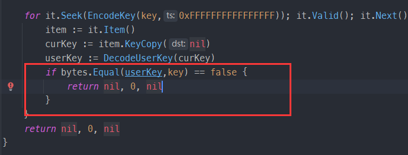
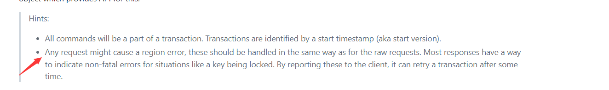
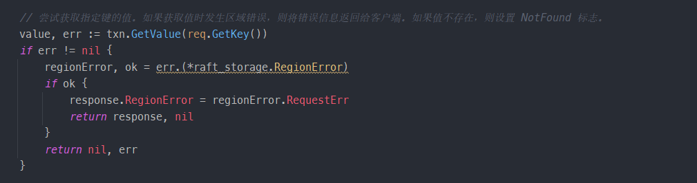
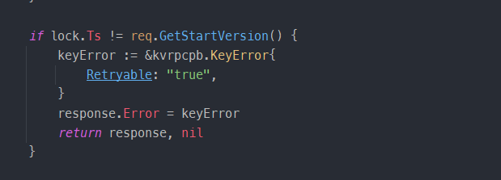
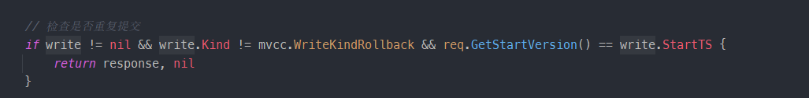
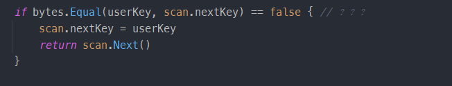
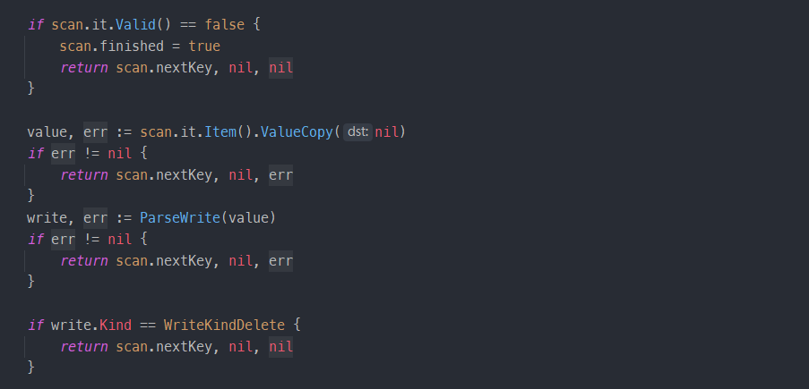
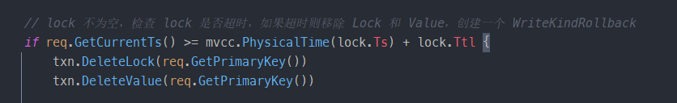
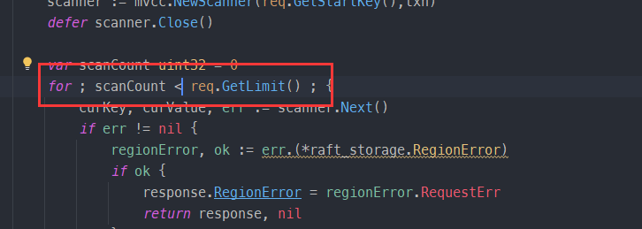
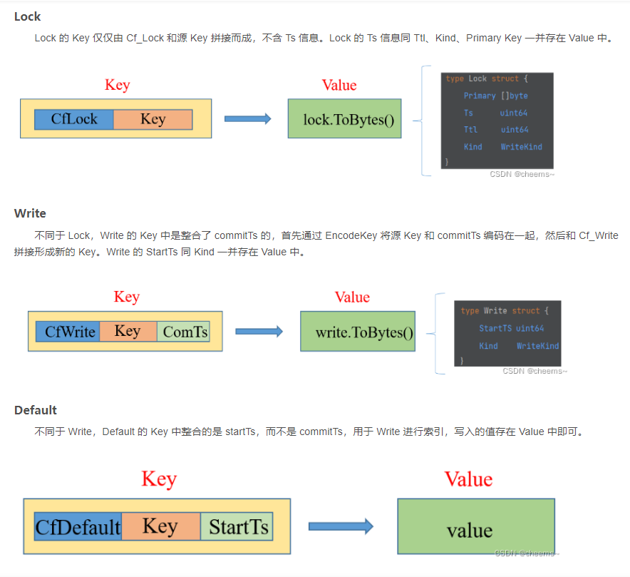

## 介绍

**4A：** 本部分是对 mvcc 模块的实现，供 project4B/C 调用，主要涉及修改的代码文件是 transaction.go。需要利用对 CFLock, CFDefault 和 CFWrite 三个 CF 的一些操作来实现 mvcc。

**4B：** project4B 主要实现事务的两段提交，即 prewrite 和 commit，需要完善的文件是 server.go。要注意的是，这要需要通过 server.Latches 对 keys 进行加锁。

**4C：** project4C 要在 project4B 的基础上，实现扫面、事务状态检查、批量回滚、清除锁这四个操作。

## 注意

1. 编码key问题，注意key还是encodekey

## 记录

4A `transaction.go`中的 CurrentWrite函数，为什么要判断？

4B 注意 Region error

4B KvGet方法，图中如果不判断 RegionError 会怎样？提示中给出了信息

4B KvCommit方法，图中如果不判断会怎样？

4B KvCommit方法，图中如果不判断会怎样？

4C Next 方法， 图中不判断会怎样？(no used)

4C Next方法，图中不返回key返回nil会怎样？不判断kind==delete会怎样？

4C KvCheckTxnStatus 方法，计算超时时间要注意什么？提示中给出了信息

4C KvScan 方法，limit无法等于

## 说明

